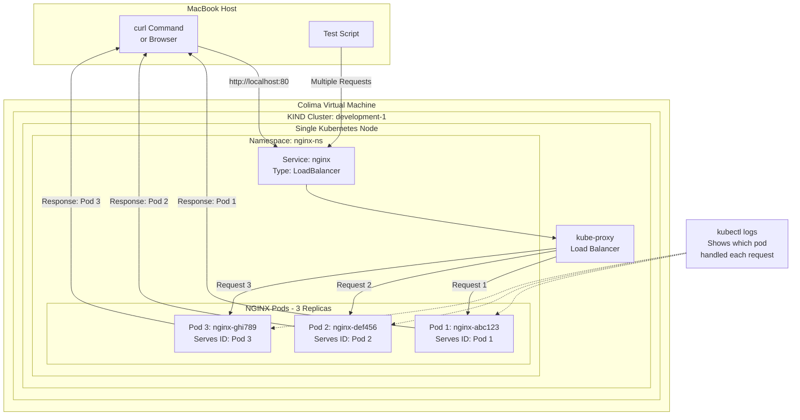

Here's a comprehensive script to set up a local Kubernetes environment on your MacBook using Colima and Kind, create a cluster with 1 node, set up a namespace, deploy a 3-replica NGINX pod, and configure load balancing:

```bash
cd "/Users/firmansyah.profess/factor-workspace/firmansyah.factor.starterkit.playground/factor.article/08. K8s"
./deepseek.setup.k8s.sh
```

# Get the URL for access
## Access Information
NGINX can be accessed via:
1. Localhost: http://localhost:80 (via LoadBalancer)
2. Direct pod access using kubectl port-forward:
   kubectl port-forward -n nginx-ns deployment/nginx-deployment 8080:80
   Then access: http://localhost:8080"

## Results:
1. Not working
2. Direct pod access using kubectl port-forward: Tested Good

## Additional Manual Configuration (if needed):

If you encounter issues with the LoadBalancer service not getting an external IP (common in local environments), you can use these alternative approaches:

### Alternative 1: Use NodePort Service [NOTE: IT'S WORK]
```bash
# Create NodePort service instead of LoadBalancer
cat > nginx-nodeport-service.yaml << EOF
apiVersion: v1
kind: Service
metadata:
  name: nginx-nodeport
  namespace: nginx-ns
spec:
  type: NodePort
  selector:
    app: nginx
  ports:
  - protocol: TCP
    port: 80
    targetPort: 80
    nodePort: 30080
EOF

kubectl apply -f nginx-nodeport-service.yaml
```

### Alternative 2: Set up Ingress Controller
```bash
# Install NGINX Ingress Controller
kubectl apply -f https://raw.githubusercontent.com/kubernetes/ingress-nginx/main/deploy/static/provider/kind/deploy.yaml

# Wait for ingress controller to be ready
kubectl wait --namespace ingress-nginx \
  --for=condition=ready pod \
  --selector=app.kubernetes.io/component=controller \
  --timeout=90s

# Create ingress resource
cat > nginx-ingress.yaml << EOF
apiVersion: networking.k8s.io/v1
kind: Ingress
metadata:
  name: nginx-ingress
  namespace: nginx-ns
spec:
  rules:
  - host: nginx.local
    http:
      paths:
      - pathType: Prefix
        path: "/"
        backend:
          service:
            name: nginx
            port:
              number: 80
EOF

kubectl apply -f nginx-ingress.yaml
```

### Alternative 3: Set up Load Balancer Service Type and MetalLB
```bash
# Install 
kubectl apply -f https://raw.githubusercontent.com/metallb/metallb/v0.13.12/config/manifests/metallb-native.yaml

# wait
kubectl wait --namespace metallb-system \
             --for=condition=ready pod \
             --selector=app=metallb \
             --timeout=90s

# Configure IP address pool
cat <<EOF | kubectl apply -f -
apiVersion: metallb.io/v1beta1
kind: IPAddressPool
metadata:
  name: local-pool
  namespace: metallb-system
spec:
  addresses:
  - 172.18.255.200-172.18.255.250
EOF

# Create the L2Advertisement resource
cat <<EOF | kubectl apply -f -
apiVersion: metallb.io/v1beta1
kind: L2Advertisement
metadata:
  name: l2-advertisement
  namespace: metallb-system
spec:
  ipAddressPools:
  - local-pool
EOF

# Create Test Pod
cat <<EOF | kubectl apply -f -
kind: Pod
apiVersion: v1
metadata:
  name: foo-app
  labels:
    app: http-echo
spec:
  containers:
  - name: foo-app
    image: hashicorp/http-echo:0.2.3
    args:
    - "-text=foo"
---
kind: Pod
apiVersion: v1
metadata:
  name: bar-app
  labels:
    app: http-echo
spec:
  containers:
  - name: bar-app
    image: hashicorp/http-echo:0.2.3
    args:
    - "-text=bar"
---
kind: Service
apiVersion: v1
metadata:
  name: foo-bar-service
spec:
  type: LoadBalancer
  selector:
    app: http-echo
  ports:
  # Default port used by the image
  - port: 5678
EOF
```


## Usage Notes:

1. **Access Applications**:
   - LoadBalancer: Use `http://localhost:80`
   - NodePort: Use `http://localhost:30080`
   - Ingress: Add `127.0.0.1 nginx.local` to your `/etc/hosts` file and access via `http://nginx.local`

2. **Monitoring**:
   ```bash
   # Watch pod status
   kubectl get pods -n nginx-ns -w
   
   # Check service details
   kubectl describe svc nginx -n nginx-ns
   
   # View logs
   kubectl logs -n nginx-ns -l app=nginx --tail=50
   ```

3. **Cleanup**:
   ```bash
   # Delete cluster
   kind delete cluster --name development-1
   
   # Stop Colima
   colima stop
   ```

This script provides a complete setup for local Kubernetes development with load balancing across multiple NGINX replicas. The setup uses Kind for Kubernetes clustering and Colima for container runtime management .


# Testing Which NGINX Pod Handles Requests

Here's how you can determine which specific NGINX pod is handling each request in your local Kubernetes setup:

## Method 1: Customize Each Pod's Response

Modify your NGINX deployment to include a unique identifier in each pod's response:

```bash
# Update your deployment to include a unique identifier
cat > nginx-deployment-unique.yaml << EOF
apiVersion: apps/v1
kind: Deployment
metadata:
  name: nginx-deployment
  namespace: nginx-ns
  labels:
    app: nginx
spec:
  replicas: 3
  selector:
    matchLabels:
      app: nginx
  template:
    metadata:
      labels:
        app: nginx
    spec:
      containers:
      - name: nginx
        image: nginx:latest
        ports:
        - containerPort: 80
        env:
        - name: POD_NAME
          valueFrom:
            fieldRef:
              fieldPath: metadata.name
        - name: POD_IP
          valueFrom:
            fieldRef:
              fieldPath: status.podIP
        # Create a custom index page that shows pod info
        command: ["/bin/sh", "-c"]
        args:
          - echo "<html><head><title>NGINX</title></head><body><h1>Pod: $$POD_NAME</h1><p>IP: $$POD_IP</p><p>Host: $$HOSTNAME</p></body></html>" > /usr/share/nginx/html/index.html &&
            exec nginx -g 'daemon off;'
EOF

# Apply the updated deployment
kubectl apply -f nginx-deployment-unique.yaml -n nginx-ns
```

## Method 2: Test with Curl Commands

```bash
# Make several requests to see which pod responds each time
for i in {1..10}; do
  echo "Request $i:"
  curl http://nginx.local/
  echo -e "\n-----------"
  sleep 1
done
```
### Result:
1. Direct pod access using kubectl port-forward via 8080: only hit one pod
2. Use NodePort Service via 30080: Load Balancer between pods is working
3. Ingress via http://nginx.local/: Load Balancer between pods is working

## Method 3: Check Pod Logs

```bash
# Check logs of all NGINX pods simultaneously
kubectl logs -l app=nginx -n nginx-ns --prefix=true --tail=5 -f
```

## Method 4: Create a Test Script

Create a script to systematically test load balancing:

```bash
cat > test-loadbalancer.sh << EOF
#!/bin/bash
echo "Testing NGINX load balancing across pods..."
echo "Current pods:"
kubectl get pods -n nginx-ns -o wide

echo -e "\nMaking 10 requests to see distribution:"
for i in {1..10}; do
  RESPONSE=\$(curl -s http://localhost:80 | grep "Pod:" | head -1)
  echo "Request $i: $RESPONSE"
  sleep 0.5
done

echo -e "\nPod request counts:"
for pod in \$(kubectl get pods -n nginx-ns -l app=nginx -o name); do
  COUNT=\$(kubectl logs \$pod -n nginx-ns | grep -c "GET / ")
  echo "\$pod: \$COUNT requests"
done
EOF

chmod +x test-loadbalancer.sh
./test-loadbalancer.sh
```

## Method 5: Real-time Monitoring

Watch the logs in real-time across all pods:

```bash
# Terminal 1: Watch all pods and their logs
kubectl get pods -n nginx-ns -l app=nginx -w

# Terminal 2: Stream logs from all pods with prefix
kubectl logs -l app=nginx -n nginx-ns --prefix=true -f

# Terminal 3: Make requests
for i in {1..20}; do
  curl -s http://localhost:80 > /dev/null
  sleep 0.3
done
```

## Method 6: Advanced Load Testing

Use a load testing tool to see distribution:

```bash
# Install hey load testing tool (if not already installed)
brew install hey

# Run load test and count responses by pod
hey -n 100 -c 10 http://localhost:80 | grep "Pod:" | sort | uniq -c
```

## Expected Output

When you run these tests, you should see output similar to:

```
Request 1: <html><body><h1>Pod: nginx-deployment-7dffc6c16f-abc12</h1>...
Request 2: <html><body><h1>Pod: nginx-deployment-7dffc6c16f-def34</h1>...
Request 3: <html><body><h1>Pod: nginx-deployment-7dffc6c16f-ghi56</h1>...
Request 4: <html><body><h1>Pod: nginx-deployment-7dffc6c16f-abc12</h1>...
```

This shows that the load balancer is distributing requests across your three NGINX pods.

## Diagram of Request Flow with Identification



These methods will help you verify that the load balancing is working correctly across your three NGINX pods in your local Kubernetes environment.


firmansyah.profess@LT-0624-022 08. K8s % export colima_host_ip=$(ifconfig bridge100 | grep "inet " | cut -d' ' -f2)
echo $colima_host_ip
192.168.64.1
firmansyah.profess@LT-0624-022 08. K8s % export colima_vm_ip=$(colima list | grep docker | awk '{print $8}')
echo $colima_vm_ip
192.168.64.2
firmansyah.profess@LT-0624-022 08. K8s % export colima_kind_cidr=$(docker network inspect -f '{{.IPAM.Config}}' kind | cut -d'{' -f2 | cut -d' ' -f1)
echo $colima_kind_cidr
export colima_kind_cidr_short=$(docker network inspect -f '{{.IPAM.Config}}' kind | cut -d'{' -f2 | cut -d' ' -f1| cut -d '.' -f1-2)
echo $colima_kind_cidr_short
172.18.0.0/16
172.18
firmansyah.profess@LT-0624-022 08. K8s % export colima_vm_iface=$(colima ssh -- ip -br address show to $colima_vm_ip | cut -d' ' -f1)
echo $colima_vm_iface
col0
firmansyah.profess@LT-0624-022 08. K8s % export colima_kind_iface=$(colima ssh -- ip -br address show to $colima_kind_cidr | cut -d' ' -f1)
echo $colima_kind_iface
br-0ee7084f9578
firmansyah.profess@LT-0624-022 08. K8s % sudo route -nv add -net $colima_kind_cidr_short $colima_vm_ip
Password:
u: inet 172.18.0.0; u: inet 192.168.64.2; u: inet 255.255.0.0; RTM_ADD: Add Route: len 132, pid: 0, seq 1, errno 0, flags:<UP,GATEWAY,STATIC>
locks:  inits: 
sockaddrs: <DST,GATEWAY,NETMASK>
 172.18.0.0 192.168.64.2 255.255.0.0
add net 172.18: gateway 192.168.64.2

firmansyah.profess@LT-0624-022 08. K8s % colima ssh
lima@colima:/Users/firmansyah.profess/factor-workspace/firmansyah.factor.starterkit.playground/factor.article/08. K8s$ sudo iptables -A FORWARD -s 192.168.64.1 -d 172.18.0.0/16 -i col0 -o br-0ee7084f9578 -p tcp -j ACCEPT
lima@colima:/Users/firmansyah.profess/factor-workspace/firmansyah.factor.starterkit.playground/factor.article/08. K8s$ exit
logout

firmansyah.profess@LT-0624-022 08. K8s % LB_IP=$(kubectl get svc/foo-bar-service -o=jsonpath='{.status.loadBalancer.ingress[0].ip}')
echo $LB_IP
172.18.255.200
firmansyah.profess@LT-0624-022 08. K8s % for _ in {1..10}; do curl ${LB_IP}:5678; done
curl: (28) Failed to connect to 172.18.255.200 port 5678 after 75002 ms: Couldn't connect to server
curl: (28) Failed to connect to 172.18.255.200 port 5678 after 75001 ms: Couldn't connect to server
curl: (28) Failed to connect to 172.18.255.200 port 5678 after 75000 ms: Couldn't connect to server
curl: (28) Failed to connect to 172.18.255.200 port 5678 after 75002 ms: Couldn't connect to server
curl: (28) Failed to connect to 172.18.255.200 port 5678 after 75002 ms: Couldn't connect to server
curl: (28) Failed to connect to 172.18.255.200 port 5678 after 75003 ms: Couldn't connect to server