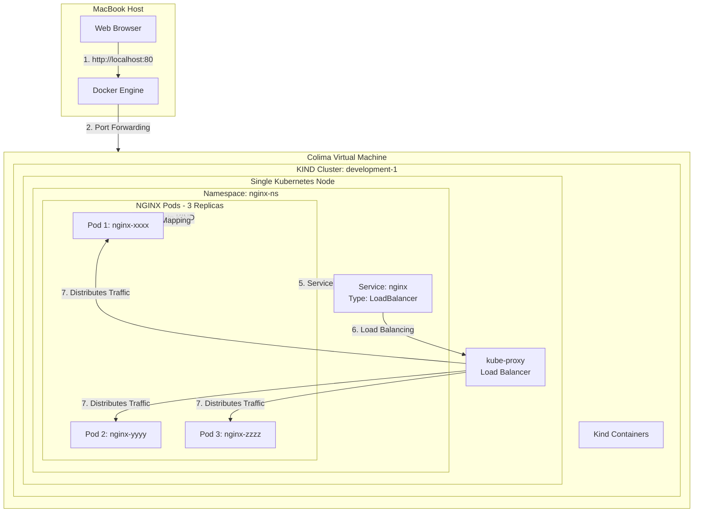
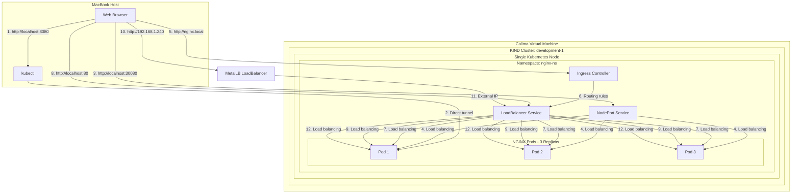
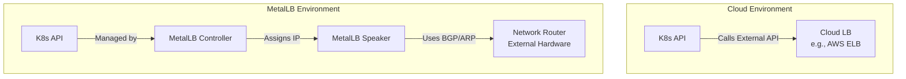
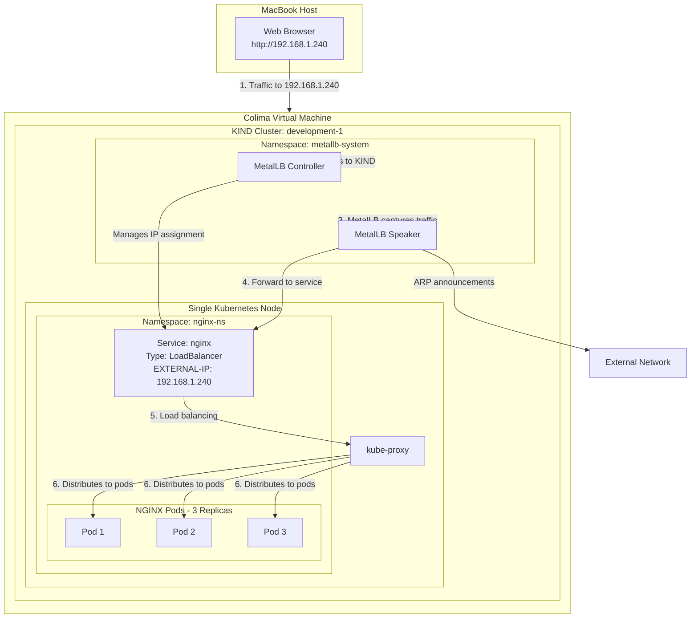
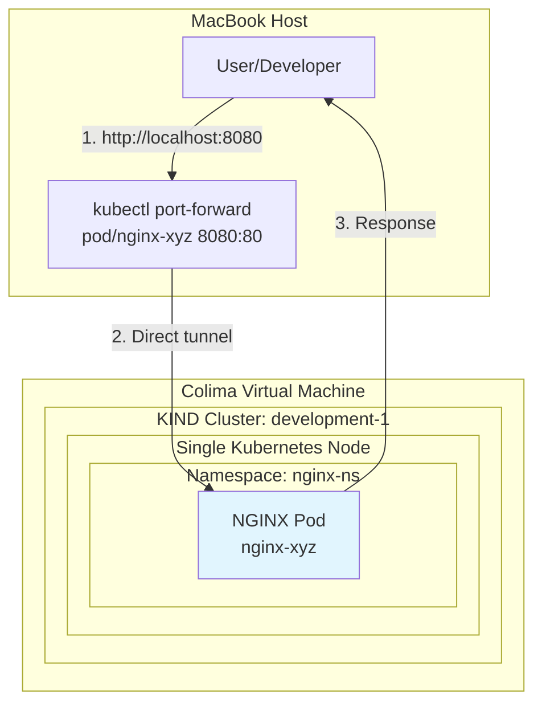
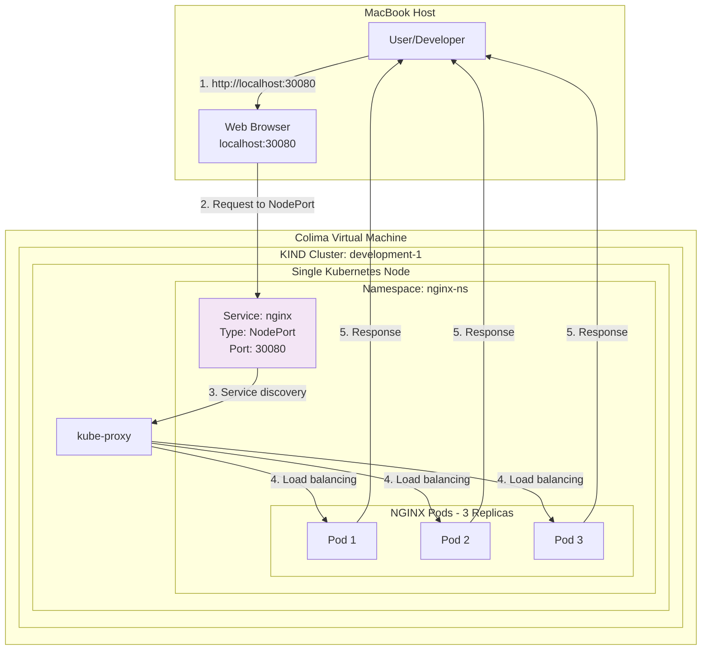
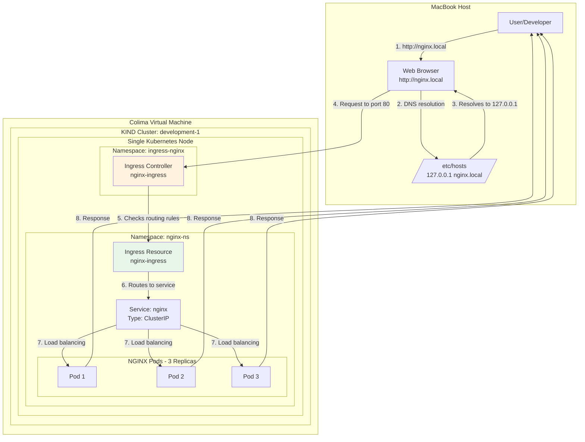

# Traffic Flow Diagram: Local Kubernetes Setup with Colima + Kind

Based on your local Kubernetes setup using Colima and Kind, here's the complete traffic flow diagram:



## Detailed Traffic Flow Explanation:

### 1. External Request (From MacBook)
```
User Browser → http://localhost:80 → Docker Host
```
- Your web browser on MacBook makes a request to localhost port 80
- Docker Desktop handles this request and forwards it to the Colima VM

### 2. Colima VM Routing
```
Docker Host → Port Forwarding → Colima VM
```
- Colima VM acts as a bridge between your MacBook and the KIND cluster
- The port mapping defined in Kind configuration forwards traffic appropriately

### 3. KIND Cluster Entry
```
Colima VM → Kind Containers → Kubernetes Node
```
- The request enters the KIND cluster running as containers
- Traffic is routed to the single Kubernetes node

### 4. Service Discovery
```
Kubernetes Node → Service: nginx (LoadBalancer)
```
- kube-proxy on the node receives the request
- It identifies the target service based on port 80

### 5. Load Balancing
```
Service → kube-proxy → Pod Selection
```
- kube-proxy acts as the load balancer (since no external LB in local env)
- It uses round-robin or session-based routing to distribute traffic

### 6. Pod Routing
```
kube-proxy → Selected NGINX Pod (one of 3 replicas)
```
- Traffic is forwarded to one of the three NGINX pods
- The selection is based on the service's endpoint list

### 7. Container Processing
```
NGINX Pod → nginx Container → Response
```
- The selected NGINX container processes the request
- Response follows the reverse path back to the user's browser

## Key Components in Your Setup:

1. **Colima VM**: Linux VM that hosts the Docker containers running KIND
2. **KIND Cluster**: Kubernetes cluster running as Docker containers
3. **Single Node**: Your development cluster has one node that acts as both control plane and worker
4. **nginx-ns Namespace**: Isolated environment for your NGINX deployment
5. **Service (LoadBalancer)**: Acts as internal load balancer (kube-proxy handles distribution)
6. **3 NGINX Pods**: Identical replicas serving traffic with load balancing

## Alternative Access Methods:

The diagram shows traffic through the LoadBalancer service (port 80), but you could also access via:

1. **NodePort**: `http://localhost:30080` (bypasses some service routing)
2. **Port Forwarding**: Direct pod access: `kubectl port-forward pod/nginx-xxxx 8080:80`
3. **Ingress**: If configured, through an ingress controller

This setup provides a complete local development environment with proper load balancing across your three NGINX replicas, all running on your MacBook through Colima and Kind.


# Traffic Routing Methods in Local Kubernetes (Colima+Kind)

Based on your local Kubernetes setup, here are the traffic routing diagrams and comparisons for all five methods:

## Traffic Routing Diagrams



## Comparison of All Methods

### 1. Direct Pod Access (kubectl port-forward)
**Pros:**
- Simplest method for debugging a specific pod
- No service configuration needed
- Works without any service or ingress setup
- Secure direct connection to a specific pod

**Cons:**
- No load balancing (hits only one pod)
- Manual process (need to run command each time)
- Not suitable for production or multi-user access
- Connection terminates if pod restarts

**Best for:** Debugging and development testing of a specific pod

### 2. NodePort Service
**Pros:**
- Simple to set up (just change service type)
- Provides basic load balancing across pods
- Works in any Kubernetes environment
- No additional components needed

**Cons:**
- Uses high port numbers (30000-32767 range)
- Exposed on all node IPs
- Less clean URL (requires port number)
- Limited to TCP/UDP protocols

**Best for:** Quick testing of service discovery and basic load balancing

### 3. Ingress Controller
**Pros:**
- Clean URLs (standard HTTP/HTTPS ports)
- Host-based and path-based routing
- SSL/TLS termination
- Production-like configuration

**Cons:**
- Requires additional ingress controller deployment
- More complex configuration
- Needs host file entries or DNS setup

**Best for:** Production-like testing and complex routing scenarios

### 4. LoadBalancer Service
**Pros:**
- Standard Kubernetes service type
- Automatically handles load balancing
- Clean port mapping (port 80)

**Cons:**
- In local environments, behaves like NodePort
- Doesn't get real external IP locally
- Limited functionality without cloud integration

**Best for:** Standardized service configuration that works across environments

### 5. MetalLB LoadBalancer
**Pros:**
- Provides real external IP addresses locally
- Closest to cloud behavior
- Proper LoadBalancer implementation
- Supports BGP and Layer 2 modes

**Cons:**
- Requires additional installation and configuration
- Needs IP address range allocation
- More complex setup
- Potential IP conflicts on local network

**Best for:** Testing cloud-like behavior in local development

## Recommendation Summary

| Method | Load Balancing | Ease of Setup | Production-like | Best Use Case |
|--------|---------------|---------------|-----------------|---------------|
| Direct Pod Access | ❌ No | ⭐⭐⭐⭐⭐ Very Easy | ❌ No | Debugging single pods |
| NodePort Service | ✅ Yes | ⭐⭐⭐⭐ Easy | ⭐⭐ Somewhat | Quick load balancing test |
| LoadBalancer Service | ✅ Yes | ⭐⭐⭐ Moderate | ⭐⭐⭐ Moderate | Standard service testing |
| Ingress Controller | ✅ Yes | ⭐⭐ Moderate | ⭐⭐⭐⭐ Very | Production-like routing |
| MetalLB LoadBalancer | ✅ Yes | ⭐ Difficult | ⭐⭐⭐⭐⭐ Exact | Cloud environment simulation |

For your local development environment with Colima+Kind, I recommend:

1. **Start with NodePort** for quick testing and validation
2. **Use Ingress** for more production-like testing scenarios
3. **Consider MetalLB** if you need exact cloud environment behavior
4. **Use direct port-forward** only for debugging specific pod issues

The LoadBalancer service type alone provides limited benefits in local environments without MetalLB, as it essentially behaves like a NodePort service but with less control over the assigned port.


When a **LoadBalancer** service in Kubernetes fails to obtain an external IP, especially in local environments (like those using Kind, Minikube, or Docker Desktop), it is typically due to the absence of cloud-provider integration or specific configuration gaps. Below are the common reasons and alternative solutions:

### 🔍 **Common Reasons for LoadBalancer Issues in Local Environments**
1.  **Lack of Cloud Provider Integration**: LoadBalancer services rely on cloud providers (like AWS, GCP, or Azure) to automatically provision external load balancers. In local setups, this integration is absent, leaving the service in a "Pending" state .
2.  **Misconfigured MetalLB**: If using MetalLB (a common solution for bare-metal/on-prem clusters), issues like incorrect IP address pools, incomplete configuration, or network conflicts can prevent IP allocation .
3.  **Network Configuration Issues**: The local network might not allow the assigned IP range to be routed correctly, or firewall rules may block traffic .
4.  **Resource Constraints**: Insufficient resources (e.g., CPU/memory) can prevent the load balancer controller from functioning properly.
5.  **Kubernetes Distribution Limitations**: Some lightweight distributions (e.g., K3s) may require additional setup for LoadBalancer support .

### 🔧 **Alternative Approaches**
1.  **Use NodePort Service**:
    *   **How it works**: Exposes the service on a high port (30000-32767) on each node. You can access it via `http://<node-ip>:<node-port>`.
    *   **Pros**: Simple, works everywhere without additional tools.
    *   **Cons**: Requires manual port management and lacks advanced features like SSL termination .
    *   **Example**:
        ```yaml
        apiVersion: v1
        kind: Service
        metadata:
          name: nginx-service
        spec:
          type: NodePort
          selector:
            app: nginx
          ports:
            - port: 80
              targetPort: 80
              nodePort: 30080
        ```

2.  **Set Up an Ingress Controller**:
    *   **How it works**: Uses an Ingress resource (e.g., NGINX Ingress Controller) to route HTTP/HTTPS traffic to services. Requires a NodePort or LoadBalancer to expose the Ingress controller.
    *   **Pros**: Supports host/path-based routing, SSL termination, and is production-ready.
    *   **Cons**: Requires additional deployment and configuration .
    *   **Steps**:
        ```bash
        # Install NGINX Ingress Controller
        kubectl apply -f https://raw.githubusercontent.com/kubernetes/ingress-nginx/main/deploy/static/provider/cloud/deploy.yaml
        # Create an Ingress resource
        kubectl apply -f ingress.yaml
        ```

3.  **Use MetalLB for Local Load Balancing**:
    *   **How it works**: MetalLB provides LoadBalancer services in bare-metal/on-prem environments by assigning external IPs from a configured pool.
    *   **Pros**: Behaves like cloud-based LoadBalancers; supports BGP and Layer 2 modes.
    *   **Cons**: Requires setup and IP range management .
    *   **Steps**:
        ```bash
        # Install MetalLB
        kubectl apply -f https://raw.githubusercontent.com/metallb/metallb/v0.13.12/config/manifests/metallb-native.yaml
        # Configure IP address pool
        cat <<EOF | kubectl apply -f -
        apiVersion: metallb.io/v1beta1
        kind: IPAddressPool
        metadata:
          name: local-pool
          namespace: metallb-system
        spec:
          addresses:
          - 192.168.1.240-192.168.1.250
        EOF
        ```

4.  **Use `kubectl port-forward` for Development**:
    *   **How it works**: Forwards a local port to a pod or service directly.
    *   **Pros**: Quick for debugging; no service exposure needed.
    *   **Cons**: Not scalable; temporary and manual.
    *   **Example**:
        ```bash
        kubectl port-forward service/nginx-service 8080:80
        ```

5.  **Leverage Cloud-Based Solutions for Local Development**:
    *   Tools like **Telepresence** or **Skaffold** can bridge local environments with cloud clusters, allowing you to use cloud LoadBalancers during development.

### 💎 **Summary**
For local Kubernetes environments, **NodePort** or **Ingress** are the simplest alternatives to LoadBalancer services. If you need full LoadBalancer behavior, **MetalLB** is the optimal choice but requires network configuration. For quick testing, **`kubectl port-forward`** is ideal. Always ensure your network environment supports the chosen method .


You've asked an excellent question that gets to the heart of how MetalLB works. The reason I drew the **MetalLB LoadBalancer component outside of the Kubernetes cluster** in the diagram is because that's where its **critical networking functions** actually operate, even though its software is installed *inside* the cluster.

Here's the detailed explanation:

---

### 1. **MetalLB Has Two Parts: One Inside, One "Outside"**

MetalLB consists of two main components that work together:

| Component | Location | Responsibility |
| :--- | :--- | :--- |
| **Controller** | ✅ Inside the Cluster (as a Pod) | Watches for Services of type `LoadBalancer`. Decides which external IP address to assign. |
| **Speaker** | ✅ Inside the Cluster (as a Pod) | **✅ Communicates with external network hardware** (routers, switches) *outside* the cluster using standard protocols (BGP or ARP). It "announces" the assigned IP to the rest of the network. |

The **Speaker** is the key. For the service to be accessible, the Speaker must tell the external network: *"Hey! If you're looking for IP address `192.168.1.240`, send the traffic to me (this specific Kubernetes node)."**

This crucial communication happens **outside the Kubernetes cluster's internal network**, which is why it's conceptually drawn externally.

---

### 2. **It Provides a "Cloud-like" Interface on Bare Metal**

In the cloud (AWS, GCP, Azure), when you create a `LoadBalancer` service, the Kubernetes control plane talks to an API *outside* the cluster (e.g., the AWS API) to provision a load balancer. This external cloud component then handles routing traffic into your cluster.

**MetalLB mimics this exact pattern but for bare-metal/local environments.** It acts as the "cloud provider" that lives both inside and outside the cluster:
*   **Inside:** It integrates with the Kubernetes API.
*   **Outside:** It integrates with your physical network's routing protocols.



---

### 3. **The Assigned External IP is a Real, Routable IP**

This is the most important point. The IP address that MetalLB assigns to your service (e.g., `192.168.1.240`) is not a virtual IP inside the Kubernetes network.

*   It is a **real, unused IP address from your physical network's subnet** (e.g., your home or office LAN).
*   For traffic to reach this IP, your **physical router** needs to know where to send it.
*   The MetalLB Speaker's job is to use the ARP or BGP protocol to tell that router: *"Send packets for `192.168.1.240` to me!"* (or to distribute this information among network peers).

This is why the functional part of MetalLB is shown outside the cluster—it's interacting with the external network infrastructure that exists beyond Kubernetes.

---

### Summary: Why It's Drawn Outside

| Reason | Explanation |
| :--- | :--- |
| **Functional Purpose** | Its primary job is to bridge the gap between the internal Kubernetes network and the **external physical network**. |
| **Network Communication** | It uses standard network protocols (ARP/BGP) that are spoken by devices **outside** the cluster (routers, switches). |
| **Conceptual Model** | It replaces an external cloud provider. Just as you'd draw "AWS" outside the cluster, you draw the MetalLB's network function outside. |

In short: The software runs inside, but its *job* is to work with the outside world. The diagram emphasizes its **functional role** in the overall network traffic flow, not just its installation location.


# Updated Traffic Flow with MetalLB Installation Location

Based on your request, here's the corrected diagram showing MetalLB's actual installation location *inside* the Kubernetes cluster while maintaining its external networking function:



## Key Corrections and Explanation:

1. **MetalLB Installation Location**:
   - MetalLB is indeed installed **inside** the Kubernetes cluster, typically in the `metallb-system` namespace
   - It consists of two main components:
     - **Controller**: Manages IP address assignment to LoadBalancer services
     - **Speaker**: Handles the external network communication

2. **How MetalLB Works Internally**:
   - The MetalLB speaker pods run on each node (or selected nodes) in your cluster
   - These speakers use ARP (Layer 2) or BGP (Layer 3) protocols to announce to your local network that they "own" the external IP addresses
   - When traffic arrives for the external IP, the speaker captures it and redirects it to the appropriate service

3. **Traffic Flow with MetalLB**:
   - External client sends request to the MetalLB-assigned IP (192.168.1.240)
   - The request reaches your MacBook's network interface
   - MetalLB's speaker intercepts this traffic (via ARP responses)
   - Traffic is forwarded to the Kubernetes service
   - The service load balances across all available pods

4. **Why It Appears "External" in Function**:
   - While MetalLB runs inside the cluster, its function is to bridge between external networks and internal services
   - It makes your local Kubernetes cluster appear to have a "real" cloud-style load balancer
   - The external IP is actually being handled by MetalLB's components inside the cluster

## Installation Location vs. Functional Role:

This corrected diagram shows that while MetalLB is installed inside the cluster (in its own namespace), it performs the functional role of an external load balancer by:

1. Managing external IP address assignment
2. Handling incoming traffic from outside the cluster
3. Making your services accessible via standard IP addresses rather than high-numbered ports

This architecture allows you to have cloud-like LoadBalancer behavior in your local development environment without needing actual cloud infrastructure.


# Kubernetes Networking Diagrams: Direct Pod Access, NodePort, and Ingress

Here are separate diagrams for each of the three access methods in your local Kubernetes environment (Colima+Kind):

## 1. Direct Pod Access (kubectl port-forward)



**How it works:**
- Creates a direct TCP tunnel between your local machine and a specific pod
- Bypasses all Kubernetes service networking
- Only accesses one specific pod (no load balancing)
- Connection is terminated if the pod restarts

## 2. NodePort Service



**How it works:**
- Exposes the service on a static high port (30000-32767) on each node
- kube-proxy handles load balancing between pods
- Accessible via any node's IP address (in localhost environment)
- Provides basic service discovery and load balancing

## 3. Ingress Controller



**How it works:**
- Uses a dedicated ingress controller (nginx-ingress) as an entry point
- Routes traffic based on hostname (nginx.local) and paths
- Requires hostname mapping in /etc/hosts or DNS
- Provides advanced routing, SSL termination, and other HTTP features
- Most production-like access method

Each of these methods serves different purposes in development and testing, with varying levels of complexity and production similarity.