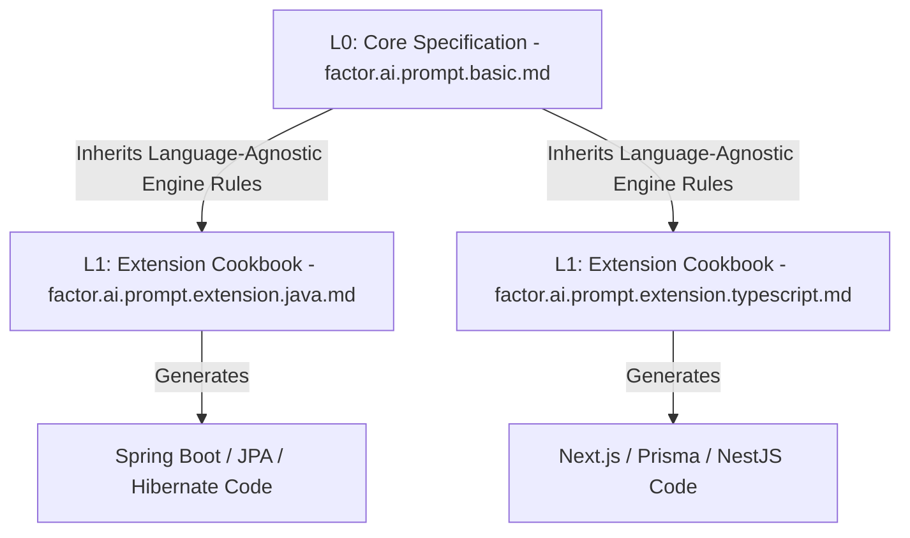

# 🪄 The Art of Introspected Generation: Enterprise Guide to Reusable AI Prompts & Extensions for The Factor

Welcome, Architect! You are holding the master key to **The Factor** (Firmansyah Advanced CRUD Generator)—a robust, high-performance, Eclipse-based code generation engine powered by **Apache FreeMarker 2.3.26**.

To generate flawless, syntactically perfect, production-grade `.ftl` templates for any programming language or framework, you must feed your AI coding assistant the exact, lossless data models and rules it needs. This guide is your enterprise-grade manual on how to use the core specification [factor.ai.prompt.basic.md](https://github.com/firmansyah-github/firmansyah-github.github.io/blob/master/factor.docs.ai.prompt/factor.ai.prompt.basic.md), leverage specialized cookbooks like [factor.ai.prompt.extension.java.md](https://github.com/firmansyah-github/firmansyah-github.github.io/blob/master/factor.docs.ai.prompt/factor.ai.prompt.extension.java.md), design your own language extensions, and harness the top 5 AI coding environments to accelerate your engineering workflow.

---

## 📖 1. The Story: Why Structured Prompts & Extensions Matter

Generic AI prompts produce generic, broken templates. FreeMarker is highly strict about types, null-checks, and syntax constraints. If an AI assistant does not know that:
* Every boolean in FreeMarker **must** be rendered using `${variable?c}` to avoid runtime rendering exceptions,
* Database type mappings are injected via pipe-delimited system comments (`PRV_SYS_` and `PUB_SYS_DTM`),
* The generation engine supports three distinct strategies (`copy`, `one`, `many`),

...it will write invalid code that crashes the Eclipse generation plugin.

### The Modular Solution
To keep templates clean, modular, and infinitely reusable, **The Factor** prompt system is divided into two layers:


1. **L0: The Core Specification (`factor.ai.prompt.basic.md`)**: The absolute, single source of truth for the entire generation engine. It defines the JDBC connection schemas (`dbs`), configuration attributes (`adv`), and table entity representations (`entity`/`ents`), alongside raw FreeMarker syntax parameters.
2. **L1: Extension Cookbooks (`factor.ai.prompt.extension.[lang].md`)**: Specialized, plugin-like overlays containing language-specific maps, naming conventions, packaging guides, and copy-paste generation recipes (such as Java JPA models, TypeScript types, or Go structures).

By separating the core engine data models from language-specific quirks, the prompts remain highly reusable and maintainable.

---

## 🚀 2. Ingesting Prompts in the Top 5 AI Coding Platforms

To maximize the power of this system, you must feed these files into your favorite AI environments as context. Here is exactly how to do it across the major 5 AI coding tools.

### 🤖 2.1. Cursor
Cursor is a premium, developer-focused IDE featuring deep context integrations.

* **How to configure**:
  1. Open your workspace settings (`.cursorrules` or **Settings -> Features -> Rules for AI**).
  2. Append references to these prompts or import them as custom `.specfiles`.
  3. During active chat or Composer sessions, reference them using the `@` symbol:
     > *"Generate a FreeMarker template for a REST controller using @factor.ai.prompt.basic.md and @factor.ai.prompt.extension.java.md"*
  4. Use **Composer** (Cmd + I) in multi-file mode, pinning the prompt files to ensure the engine rules guide the generation.

### 🐱 2.2. GitHub Copilot & Copilot Chat
GitHub Copilot is the industry standard for inline completions and contextual chat inside VS Code or JetBrains.

* **How to configure**:
  1. Create or open the workspace file: `.github/copilot-instructions.md`.
  2. Add the following instruction:
     ```markdown
     When generating FreeMarker (.ftl) templates for the code generation engine "The Factor", you MUST adhere strictly to the rules and data model specified in `factor.ai.prompt.basic.md` and any active language extension documents.
     ```
  3. In **Copilot Chat**, reference the prompt files directly using the `#file` command:
     > *"Explain how to fetch primary keys in FreeMarker based on `#file:factor.ai.prompt.basic.md`"*

### 🌊 2.3. Windsurf
Windsurf is the first agentic IDE, providing a powerful collaborative flow using "Cascade".

* **How to configure**:
  1. In the **Cascade Chat** panel, pin files to the session context using the pin icon.
  2. Pin both `factor.ai.prompt.basic.md` and your active language extension (e.g., `factor.ai.prompt.extension.java.md`).
  3. Give Cascade an agentic goal:
     ```text
     "Analyze our current schema requirements and, utilizing the pinned basic specifications, create a database migration FTL template."
     ```
  4. Cascade's agent will write the file, validate the syntax rules, and handle directory pathing automatically.

### 🧠 2.4. Claude Projects (Anthropic)
Claude Projects allow users to build highly targeted sandboxes with curated knowledge bases.

* **How to configure**:
  1. Go to your Claude.ai account, navigate to **Projects**, and create a new project called **"The Factor - Template Generator"**.
  2. In the **Project Knowledge** sidebar, upload:
     * `factor.ai.prompt.basic.md`
     * `factor.ai.prompt.extension.java.md` (and any other language extensions).
  3. In the **Custom Instructions** text field, add:
     ```text
     You are the master template engineer for The Factor. Every time I ask you to generate a template, you must strictly respect the variables, naming schemas, mapping comment standards, and FreeMarker rules described in the uploaded Project Knowledge files.
     ```
  4. Use the chat window to generate production-grade FTLs instantly.

### ♊ 2.5. Google AI Studio & Gemini Advanced
Gemini's massive multi-million token context window allows you to upload entire codebases alongside instructions.

* **How to configure**:
  1. In **Google AI Studio** (for developers) or **Gemini Advanced** (with Gemini 1.5 Pro / Gemini 3.5 Flash):
  2. Create a new prompt in **System Instructions** mode.
  3. Paste the complete contents of `factor.ai.prompt.basic.md` directly into the **System Instructions** box to ground Gemini's base intelligence.
  4. When prompting, attach the target language extension as a reference file. Gemini will output extremely long, hyper-accurate templates without truncating or skipping structural segments.

---

## 🛠️ 3. How to Create an AI Prompt Extension

When you need to support a new language, web framework, or database system, you must create a new **L1 Extension Cookbook**. 

### 🌟 3.1. The Golden Rules of Extension Design
To keep your extensions fully reusable and standardized, follow these four rules:
1. **Never redefine L0 engine attributes**: Do not rename `${entity.tableName}` or `${field.fieldName}`. Let the core handles remain untouched.
2. **Explicit Type Mapping block**: Every extension must supply a copy-pasteable `PUB_SYS_DTM` block inside a FreeMarker comment. This allows the generator engine to programmatically rewrite types before parsing.
3. **Establish Namespace Patterns**: Standardize how packages, modules, or directories are written using `PRV_SYS_JAVA_PACKAGE` or equivalent modular systems.
4. **Supply Complete Generation Recipes**: Include at least two end-to-end, error-free recipes that cover:
   * **`many` strategy**: Generates one file per database table (e.g., standard models, services, or controllers).
   * **`one` strategy**: Generates a single, global project file (e.g., config structures, route loaders, or migration scripts).

---

### 📋 3.2. Step-by-Step Blueprint for Creating a New Extension

Copy the template below to create extensions for languages like TypeScript, Go, Python, C#, or Rust.

```markdown
# AI Prompt Extension: [Language/Framework] Cookbook for The Factor

This document is the formal **[Language] Extension** to the core, language-agnostic [factor.ai.prompt.basic.md](https://github.com/firmansyah-github/firmansyah-github.github.io/blob/master/factor.docs.ai.prompt/factor.ai.prompt.basic.md). When generating FreeMarker templates specifically for [Language] targets, combine this cookbook with the core specification.

---

## 1. System Integration Context
Briefly explain how [Language] projects structure code (e.g., modular folders, namespaces, imports) and how the generation engine maps to them.

---

## 2. Language-Specific Conventions
Define how variables translate:
* `${entity.className}` -> PascalCase naming (e.g., `UserSession`).
* `${entity.instanceName}` -> camelCase naming (e.g., `userSession`).
* How import packages or module systems are handled (e.g., ES Modules, Go Imports).

---

## 3. Database-to-[Language] Type Mapping (`PUB_SYS_DTM`)
Provide the exact public system data type mapping block to copy into the template header.

```freemarker
<#--
${PUB_SYS_DTM@integer|[Target Type]|[Description]}
${PUB_SYS_DTM@varchar|[Target Type]|[Description]}
${PUB_SYS_DTM@timestamp|[Target Type]|[Description]}
-->
\```

---

## 4. End-to-End [Language] Recipes
Create fully functional FreeMarker examples illustrating:
* **Recipe 1**: A single-entity model mapping (`many` strategy).
* **Recipe 2**: A global schema mapper or config loader (`one` strategy).
```

---

## ✍️ 4. Best Practices for Perfect FreeMarker Syntax

When writing templates with the help of your AI assistant, always double-check these critical syntactical details to prevent runtime failures:

> [!WARNING]
> **The Boolean Trap**: In FreeMarker 2.3.26, writing `${field.nullable}` or `${entity.hasPrimaryKey}` will throw an exception if evaluated directly as a string. You **MUST** append `?c` (e.g., `${field.nullable?c}`) to force the engine to convert the boolean to a literal `"true"` or `"false"` string.

> [!TIP]
> **The Null-Safe Fallback**: Database remarks and custom configurations can often be null. Protect your code by specifying default values using the `!` operator:
> * `${entity.remarks!'No description available.'}`
> * `${field.nullValue!'null'}`

> [!IMPORTANT]
> **No Dynamic Expressions in Comments**: The Factor engine scans for pipe-delimited system attributes (like `${PRV_SYS_GEN_PATH|...}`) *before* executing the FreeMarker template. Never put dynamic FreeMarker expressions (e.g., `${variable}`) inside the default value field of a `PRV_SYS_` or `PUB_` attribute declaration.

---

## ✅ 5. Summary Checklist for Template Generation

Before submitting a generated template to **The Factor** workspace:
1. **Comment Headers**: Are your `PRV_SYS_` attributes declared in a pipe-delimited format in the top comment block?
2. **Boolean Outputs**: Is every boolean output formatted with `?c`?
3. **Collection Looping**: Did you use the proper lists (e.g., `entity.fieldListSortByOrdinalPosition` or `entity.primaryKeyFieldList`)?
4. **Relational Constraints**: Are compound keys handled by looping over `entity.primaryKeyFieldList` or utilizing key attributes?
5. **No Dynamic Defaults**: Are your system attributes clean of dynamic FreeMarker code inside comment declarations?

By combining the structural power of the **Core Specification** with targeted **Extension Cookbooks**, you can direct any modern AI tool to produce clean, enterprise-grade, error-free code templates in a matter of seconds. Happy generating!
