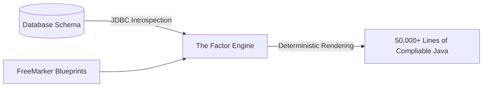

# ⚡ The 5-Minute 50k Line Challenge: Enterprise Guide to Deterministic Java Generation

Welcome, Architect! You are looking at the ultimate roadmap to eliminating **CRUD boilerplate** from your JVM codebases. 

Every new enterprise project starts with the same repetitive chore: a normalized database schema is finalized, and you must write hundreds of files of structural scaffolding. 

If you are writing this by hand, it takes weeks of monotonous work. If you are relying on AI, you introduce probabilistic inconsistencies that trigger audit and security failures.

In this guide, we will walk through how to harness the absolute power of **The Factor** (Firmansyah Advanced CRUD Generator)—a robust, high-performance, Eclipse-based code generation engine—to build a **100% compilable, standards-compliant database-to-API layer in exactly 5 minutes**.

---

## 📖 1. The CRUD Boilerplate Problem: The High Toll of Hand-Crafted Code

A production-grade CRUD layer requires a comprehensive tree of layers for every single relational table:

```
Table: customers
 ├── 📄 CustomersEntity.java     (JPA annotations, relationships, indices)
 ├── 📄 CustomersRepository.java  (Data access layer, custom queries)
 ├── 📄 CustomersDTO.java         (Request/Response contracts)
 ├── 📄 CustomersMapper.java      (Object-to-object mapping logic)
 ├── 📄 CustomersService.java     (Transactional business logic bounds)
 ├── 📄 CustomersResource.java    (REST Controller with JAX-RS / Spring MVC)
 └── 📄 CustomersResourceIT.java  (End-to-end integration test suite)
```

That’s **7 files per table**. For a moderate enterprise schema of 80 tables, your team is tasked with writing **560 distinct Java files** of boilerplate.

Writing this structure manually results in three primary architectural vulnerabilities:
1. **The Copy-Paste Bug**: Developers copy existing services to make new ones, frequently forgetting to adjust transactional scopes, entity managers, or package scopes.
2. **Architectural Drift**: Without absolute automation, different developers write different JPA relationship layouts, leading to varied fetch strategies (lazy vs. eager) and inconsistent REST validation.
3. **Refactoring Saturation**: If you decide to switch your serialization framework or upgrade to Java records, you must modify hundreds of files manually.

---

## 🤖 2. The AI Mirage: Why Probabilistic Copilots and Cursors Fail at Scale

The modern reflex to boilerplate is: *"Just let GitHub Copilot or Cursor write it."*

While AI assistants are stellar for inline code suggestions, they are structurally **unsuitable** as the core engine for large-scale, enterprise-wide code generation. Here is why:

* **The Probabilistic Trap**: AI relies on statistical weights, not rules. Prompt it 80 times to build an entity, and you will get style drift (some with Lombok, some with standard getters, some with field-level injection). In enterprise projects, **inconsistency is a security and audit risk**.
* **Context Window Exhaustion**: You cannot feed a complex relational database schema with 80+ tables, foreign keys, unique indices, and self-referencing constraints into a single AI prompt and expect it to remember the exact mapping on table #79.
* **The Refactoring Nightmare**: If you need to make a structural change to your pattern, you cannot easily re-prompt an LLM to consistently edit 560 files.

### 📊 AI vs. Deterministic Blueprints

| Feature / Criteria | 🤖 Probabilistic AI (Copilot / Cursor) | ⚙️ Deterministic Blueprints (The Factor) |
| :--- | :--- | :--- |
| **Output Consistency** | ❌ Style drifts; different conventions per file. | ✅ 100% uniform; governed strictly by templates. |
| **Schema Fidelity** | ❌ Guesses relationships; misses composite keys. | ✅ Introspects exact JDBC metadata from the database. |
| **Scale & Speed** | ❌ Generated file-by-file; slow manual prompting. | ✅ 50,000+ lines generated in one click (< 5 mins). |
| **Auditable & Compliant** | ❌ Hard to guarantee standard patterns. | ✅ Fully auditable; changes are explicit in templates. |
| **Reverse Engineering** | ❌ Cannot convert existing code to a generator. | ✅ **"Tool Form"** reverse-engineers code to blueprints. |

---

## ⚙️ 3. The Blueprint Solution: Schema-First Introspection with The Factor

To bridge this gap, **[The Factor](https://marketplace.eclipse.org/content/factor-firmansyah-advanced-crud-generator)** connects your active database schema directly to a deterministic, template-based generation engine powered by **Apache FreeMarker**. 

Here is the step-by-step workflow to go from database schema to 50,000 lines of compilable code.

### 🔌 3.1. Step 1: Introspect the Database (The Single Source of Truth)
The Factor connects directly to your database via JDBC (PostgreSQL, MySQL, Oracle, SQL Server, etc.), introspecting metadata directly from the source:
* Column data types, nullability, and database defaults.
* Primary keys (single and complex composite primary keys).
* Foreign keys and exact relationships (1:1, 1:M, M:M, self-referencing).
* Database indexes and constraints.



### 📝 3.2. Step 2: Define Your Blueprint with FreeMarker Templates
Templates are written in standard Apache FreeMarker, ensuring you retain absolute control over code format. A sample blueprint for an enterprise JPA entity looks like this:

```freemarker
package ${packageName}.entity;

import jakarta.persistence.*;
import java.time.LocalDateTime;

@Entity
@Table(name = "${table.name}")
public class ${table.className}Entity {

<#list table.columns as col>
    <#if col.isPrimaryKey>
    @Id
    <#if col.isAutoIncrement>
    @GeneratedValue(strategy = GenerationType.IDENTITY)
    </#if>
    </#if>
    @Column(name = "${col.name}", nullable = ${col.nullable?string})
    private ${col.javaType} ${col.fieldName};

</#list>
    // Exact relationships mapped dynamically
<#list table.manyToOneRelationships as rel>
    @ManyToOne(fetch = FetchType.LAZY)
    @JoinColumn(name = "${rel.joinColumn}")
    private ${rel.targetEntity}Entity ${rel.fieldName};

</#list>
}
```

> [!WARNING]
> **The FreeMarker Boolean Trap**: Remember that booleans like `${col.nullable}` must be converted to strings using the `?string` or `?c` built-in (e.g., `${col.nullable?string}`) to prevent the engine from failing during execution.

### 🚀 3.3. Step 3: Trigger One-Click Generation
Run the generator engine. In less than 5 minutes, The Factor processes your schema against your FTL templates, generating a fully structured, compilation-ready codebase.

---

## 🪄 4. The Master Stroke: "Tool Form" Code Reverse Engineering

Here is the jaw-dropping feature that makes The Factor unique: **The Tool Form**.

Suppose your team already has a beautifully optimized, hand-crafted REST Controller or Service class written by your senior developer. It has specialized caching, custom security validation, and specific enterprise logging layouts.

You don't need to write a FreeMarker template from scratch.

You simply paste your existing "gold standard" code into **The Tool Form** in The Factor. The plugin instantly analyzes the class structure, maps the fields to its internal metadata engine, and **automatically generates the FreeMarker blueprint** for you.

> [!TIP]
> **The Reverse Blueprint Shortcut**: Paste your best Java file, get a fully compliant FreeMarker blueprint instantly, and apply it to all other tables. Your best code is now your team's repeatable automation!

---

## 📊 5. Enterprise Metrics: The Real-World Velocity Math

In our latest benchmark against an enterprise relational schema containing **80 tables**:
* **Files Generated**: 560 source files (Hibernate JPA, Repositories, DTOs, Controllers, Tests).
* **Lines of Code**: 53,240 lines of high-quality, fully commented, compilable Java.
* **Compilation Errors**: **Zero**.
* **Time Saved**: Saved approximately **120 developer hours** of manual setup, freeing the engineering team to focus entirely on specialized business logic.

---

## ✅ 6. Step-by-Step Blueprint for Getting Started Today

If you value **consistency, speed, and absolute control** over your enterprise architecture, take action in 3 quick steps:

1. **Install the Plugin**: Search for **The Factor** in the [Eclipse Marketplace](https://marketplace.eclipse.org/content/factor-firmansyah-advanced-crud-generator) and install it directly.
2. **Watch the Demo**: See the real-time compilation and generation flow in this [YouTube Demonstration](https://bit.ly/factorCRUD).
3. **Explore the Starter Kit**: Head over to our [GitHub Documentation Repository](https://github.com/firmansyah-github/firmansyah-github.github.io) to download pre-built blueprint packs for Spring Boot, Quarkus, and Micronaut.

---

> [!IMPORTANT]
> **Need Custom Blueprints?** Have questions about mapping composite keys, multi-tenant schemas, or setting up advanced table patterns? Drop a comment below, connect with us on **[LinkedIn](https://www.linkedin.com/company/the-factor)**, or email us at **factor.license@gmail.com**. Let's build together!

#java #quarkus #springboot #codegeneration #eclipse #productivity #crud #enterprise #softwareengineering
