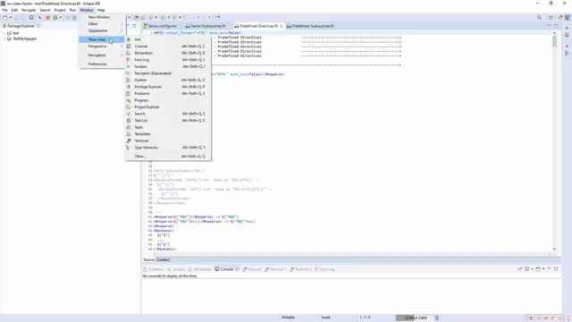
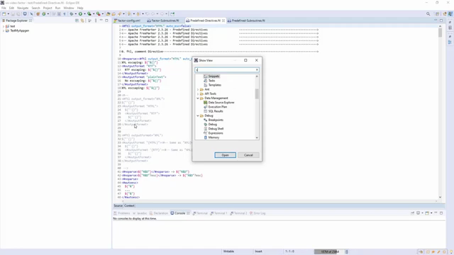
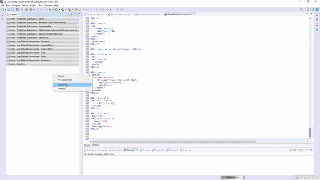
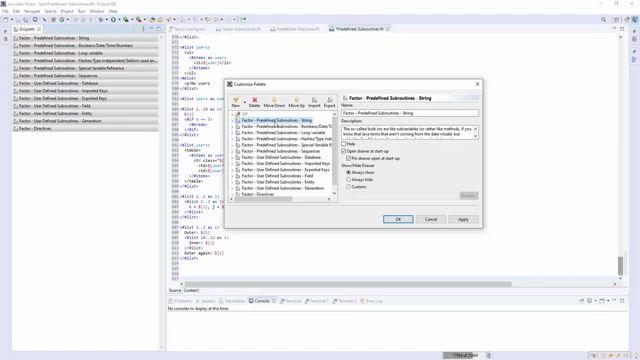
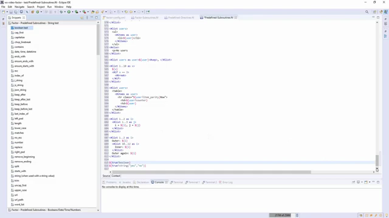
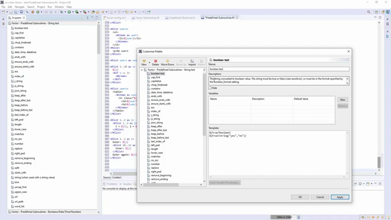

# 🔌 Eclipse XML Snippets: The Factor Rapid Template Kit
### *Accelerating FreeMarker Blueprint Development inside Eclipse IDE*

Welcome to the **Eclipse XML Snippets Workspace**. This guide will show you how to leverage pre-configured, modular code snippet libraries to achieve **maximum velocity** when writing and customising templates for **The Factor (Firmansyah Advanced CRUD Generator) Eclipse Plugin**.

---

## 🚀 The Velocity Factor: Why Use IDE Snippets?

In enterprise software engineering, **speed and consistency** determine project success. When writing advanced code generation blueprints, memorizing FreeMarker directives, subroutines, and custom database metadata variables can introduce cognitive load and syntax errors.

**Eclipse Snippets** act as high-velocity code macros. By integrating these pre-written XML fragment libraries into your Eclipse IDE workspace, you gain the power to insert complex template blocks, loop constructs, formatting filters, and annotation structures instantly with a simple **double-click or drag-and-drop**.

### 📺 High-Quality Video Reference & Walkthrough
To see this system demonstrated in real-time, refer to our comprehensive video guide:
👉 **[Watch the Eclipse Snippets Masterclass (YouTube)](https://www.youtube.com/watch?v=N4v91GyLumw&t=372s)**

---

## 🎨 Autocomplete & Content Assist in Action

By importing our XML snippet suites into Eclipse, you unlock **Content Assist of The Factor FreeMarker**. Typing the `<@` directive prefix followed by `Ctrl + Space` immediately launches the custom auto-complete panel, which displays all user-defined macros and subroutines dynamically inside your editor window.

Below is an exact visual frame capture demonstrating the auto-complete popup inside the active Eclipse template editor at **[timestamp 06:12](https://www.youtube.com/watch?v=N4v91GyLumw&t=372s)**:

> [!IMPORTANT]
> **Pro-Tip for Developers:** To trigger this intelligent popup, ensure your cursor is placed directly after the `<@` characters inside your `.ftl` file, then press the standard Eclipse hotkey combination `Ctrl + Space` (or `Cmd + Space` on macOS).

---

## 🗃️ The Complete XML Snippets Suite Catalog

We have structured the 15 pre-configured XML snippet files into three logical, production-ready suites to help you quickly identify the tools you need for your scaffolding requirements:

### Suite A: FreeMarker Core & Built-in Subroutines
*Focuses on standard FTL formatting, looping structures, data-type conversions, and core language directives.*

| File Name | Functional Coverage | Key Templates Included |
| :--- | :--- | :--- |
| [**Factor - Predefined Subroutines - String.xml**](https://github.com/firmansyah-github/firmansyah-github.github.io/blob/master/factor.docs.eclipse.snippets/Factor%20-%20Predefined%20Subroutines%20-%20String.xml) | Text & case manipulations | `?cap_first`, `?uncap_first`, `?upper_case`, `?lower_case`, `?replace` |
| [**Factor - Predefined Subroutines - Loop variable.xml**](https://github.com/firmansyah-github/firmansyah-github.github.io/blob/master/factor.docs.eclipse.snippets/Factor%20-%20Predefined%20Subroutines%20-%20Loop%20variable.xml) | Loop state queries | `_index`, `_has_next`, `_is_first`, `_is_last` |
| [**Factor - Predefined Subroutines - Booleans:Date:Time:Numbers.xml**](https://github.com/firmansyah-github/firmansyah-github.github.io/blob/master/factor.docs.eclipse.snippets/Factor%20-%20Predefined%20Subroutines%20-%20Booleans:Date:Time:Numbers.xml) | Type casting & conversions | `?string("yes", "no")`, `?string("yyyy-MM-dd")`, `?c` (Computer Number Format) |
| [**Factor - Predefined Subroutines - Special Variable Reference.xml**](https://github.com/firmansyah-github/firmansyah-github.github.io/blob/master/factor.docs.eclipse.snippets/Factor%20-%20Predefined%20Subroutines%20-%20Special%20Variable%20Reference.xml) | Engine metadata lookups | `.now` (Current Timestamp), `.version`, `.main_template_name` |
| [**Factor - Predefined Subroutines - Hashes:Type independent:Seldom used and Expert.xml**](https://github.com/firmansyah-github/firmansyah-github.github.io/blob/master/factor.docs.eclipse.snippets/Factor%20-%20Predefined%20Subroutines%20-%20Hashes:Type%20independent:Seldom%20used%20and%20Expert.xml) | Specialized advanced utilities | `?keys`, `?values`, `?is_sequence`, `?is_hash` |
| [**Factor - Predefined Subroutines - Sequences.xml**](https://github.com/firmansyah-github/firmansyah-github.github.io/blob/master/factor.docs.eclipse.snippets/Factor%20-%20Predefined%20Subroutines%20-%20Sequences.xml) | Array/list operations | `?first`, `?last`, `?seq_contains`, `?join` |
| [**Factor - Directives.xml**](https://github.com/firmansyah-github/firmansyah-github.github.io/blob/master/factor.docs.eclipse.snippets/Factor%20-%20Directives.xml) | FTL flow controllers | `<#list>`, `<#if>`, `<#assign>`, `<#macro>`, `<#import>` |

---

### Suite B: The Factor Domain Model & Database Subroutines
*Custom-designed macros that map metadata from your active SQL schemas into entity and generation templates.*

| File Name | Functional Coverage | Key Scaffolding Attributes |
| :--- | :--- | :--- |
| [**Factor - User Defined Subroutines - Database.xml**](https://github.com/firmansyah-github/firmansyah-github.github.io/blob/master/factor.docs.eclipse.snippets/Factor%20-%20User%20Defined%20Subroutines%20-%20Database.xml) | Target database connections | `${db.catalog}`, `${db.schema}`, `${db.productName}` |
| [**Factor - User Defined Subroutines - Entity.xml**](https://github.com/firmansyah-github/firmansyah-github.github.io/blob/master/factor.docs.eclipse.snippets/Factor%20-%20User%20Defined%20Subroutines%20-%20Entity.xml) | Code entity metadata | `${table.name}`, `${table.capitalizedName}`, `${table.comment}` |
| [**Factor - User Defined Subroutines - Field.xml**](https://github.com/firmansyah-github/firmansyah-github.github.io/blob/master/factor.docs.eclipse.snippets/Factor%20-%20User%20Defined%20Subroutines%20-%20Field.xml) | Columns/fields configurations | `${field.name}`, `${field.javaType}`, `${field.isNullable}`, `${field.isPrimaryKey}` |
| [**Factor - User Defined Subroutines - Exported Keys.xml**](https://github.com/firmansyah-github/firmansyah-github.github.io/blob/master/factor.docs.eclipse.snippets/Factor%20-%20User%20Defined%20Subroutines%20-%20Exported%20Keys.xml) | Foreign Key outgoing references | `${exportedKey.pkTableName}`, `${exportedKey.fkColumnName}` |
| [**Factor - User Defined Subroutines - Imported Keys.xml**](https://github.com/firmansyah-github/firmansyah-github.github.io/blob/master/factor.docs.eclipse.snippets/Factor%20-%20User%20Defined%20Subroutines%20-%20Imported%20Keys.xml) | Foreign Key incoming references | `${importedKey.pkTableName}`, `${importedKey.fkColumnName}` |
| [**Factor - User Defined Subroutines - Generation.xml**](https://github.com/firmansyah-github/firmansyah-github.github.io/blob/master/factor.docs.eclipse.snippets/Factor%20-%20User%20Defined%20Subroutines%20-%20Generation.xml) | Project target directories | `${generation.projectFolder}`, `${generation.packageName}` |

---

### Suite C: Master Bundle Packs
*Complete suites ready for batch imports.*

| File Name | Bundle Details | Recommendation |
| :--- | :--- | :--- |
| [**factor-snippets-all-with-user-defined.xml**](https://github.com/firmansyah-github/firmansyah-github.github.io/blob/master/factor.docs.eclipse.snippets/factor-snippets-all-with-user-defined.xml) | Includes ALL core FreeMarker and Factor custom metadata macros. | **Highly Recommended** for comprehensive template design workspaces. |
| [**factor-snippets-all-without-user-defined.xml**](https://github.com/firmansyah-github/firmansyah-github.github.io/blob/master/factor.docs.eclipse.snippets/factor-snippets-all-without-user-defined.xml) | Includes ONLY the core FreeMarker language and syntax macros. | Recommended for pure, generic FTL template authoring. |

---

## ⚙️ Step-by-Step Guide: Importing Snippets

Follow these structured steps to load the XML snippet files into your active Eclipse workspace environment:

### Step 1: Open the Eclipse Snippets View
1. Launch your **Eclipse IDE**.
2. From the top application menu bar, navigate to:  
   **Window ➡️ Show View ➡️ Other...**

   
   *Figure 1.1: Navigating to Window ➡️ Show View ➡️ Other... from the Eclipse top menu bar.*

3. In the pop-up search dialog, expand the **General** folder, select **Snippets**, and click **Open**.

   
   *Figure 1.2: Filtering and selecting "Snippets" in the "Show View" modal dialog.*

4. The Snippets drawer panel will initialize in your Eclipse UI layout (typically docked alongside your outline or console drawers).

---

### Step 2: Import the XML Suites
1. In the **Snippets view**, right-click anywhere in the panel to open the context menu and select **Customize...**.

   
   *Figure 2.1: Right-clicking the Snippets drawer to access the "Customize..." settings.*

2. This will launch the **Customize Palette** wizard window. Click the **Import...** button located in the dialog toolbar.

   
   *Figure 2.2: The "Customize Palette" dashboard, highlighting the "Import..." and "Export..." tool actions.*

3. Browse your local files and navigate to this workspace subdirectory:  
   `./factor.docs.eclipse.snippets/`
4. Choose **`factor-snippets-all-with-user-defined.xml`** for the full suite, or select a specific file from Suite A/B based on your current project focus.
5. Click **Open** (or **OK**). The importer will parse the XML and generate structured drawers instantly.

---

### Step 3: Accelerate Your Coding (Use & Customize)
* **Drag-and-Drop / Double-Click:** To insert a snippet, drag it directly from the Snippets view and drop it into your active `.ftl` template file at your targeted line number. Alternatively, double-click the snippet in the panel to insert it instantly at your cursor.

  
  *Figure 3.1: A successful FTL directive code block generated instantly in the Eclipse editor after double-clicking the snippet item.*

* **Customizing Snippets:** Right-click any imported snippet item inside the panel and select **Customize...** to tweak the default template code blocks, insert dynamic input variables, or modify descriptions.

  
  *Figure 3.2: Modifying template properties, variables, and default FTL statements within the Customize item details panel.*

> [!TIP]
> **Workflow Insight:** The above screenshots show the exact sequence of customizing snippet parameters and immediately injecting the dynamic macro into the active `.ftl` template file with zero syntax friction.

---

## 👥 Enterprise Best Practices: Shared Team Blueprints

For engineering teams working in enterprise environments, **consistency of code patterns is vital**. To prevent team member templates from drifting out of sync:
1. **Define a Core Standard:** Have a lead architect customize a central set of XML snippets representing the team's approved database annotations, audit fields, and design pattern structures.
2. **Export the Blueprint:** Click the **Export Snippets** icon on the Snippets toolbar to write your customized drawers to a unified XML file.
3. **Version Control:** Commit the exported XML file directly into your shared Git repository (e.g. inside a `/team-snippets/` directory).
4. **Onboard New Engineers:** Instruct all incoming developers to import the team's custom XML blueprint file as part of their initial developer environment onboarding setup.

---

## 🤝 Need Custom Scaffolding Blueprints?
The **Firmansyah Factor Enterprise Team** provides customized XML snippet suites and tailored macro drawers mapping directly to your proprietary architectures (Hexagonal, Microservices, Event-Driven).
📧 **[factor.license@gmail.com](mailto:factor.license@gmail.com)**

*Playground maintained by [firmansyah-github](https://github.com/firmansyah-github). Streamline your scaffolding today!*
