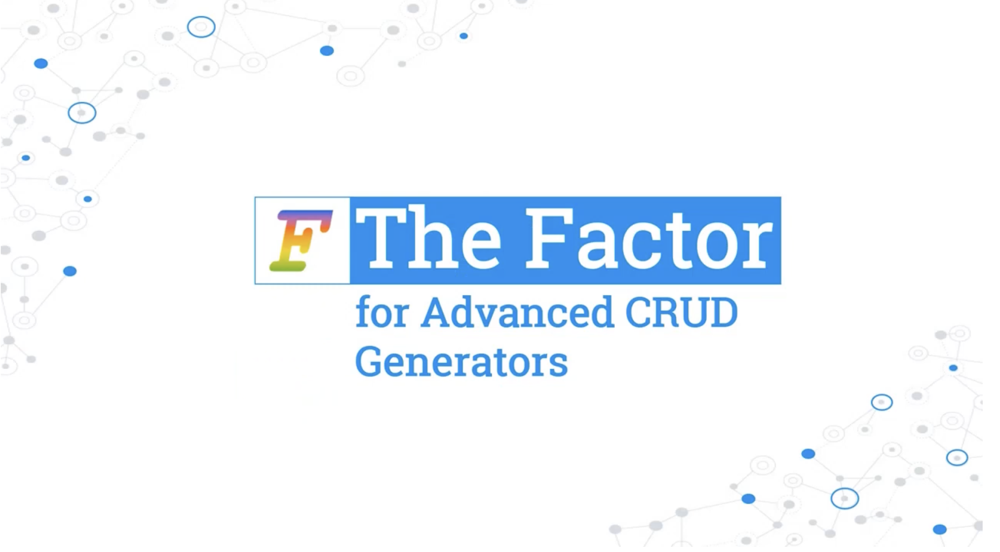
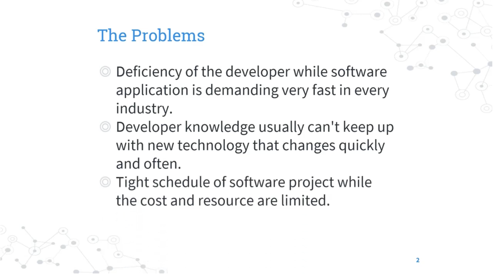
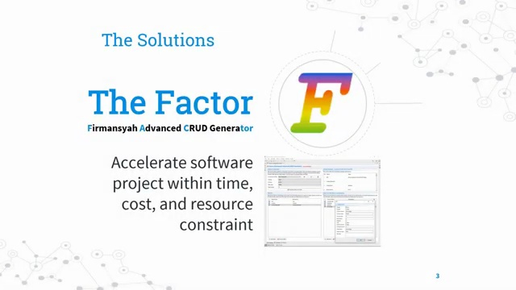
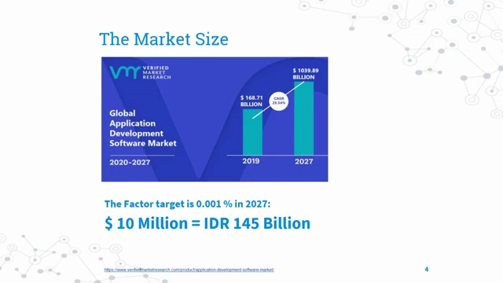
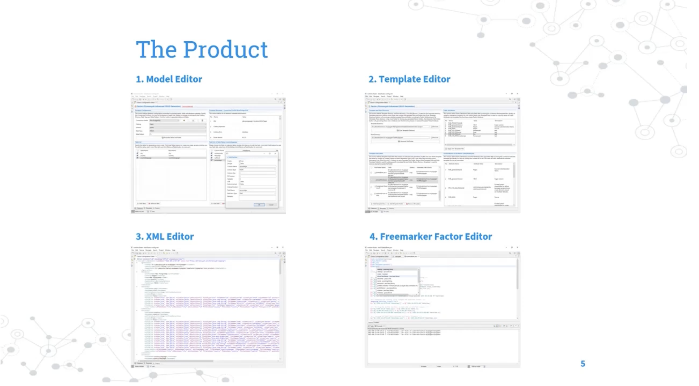
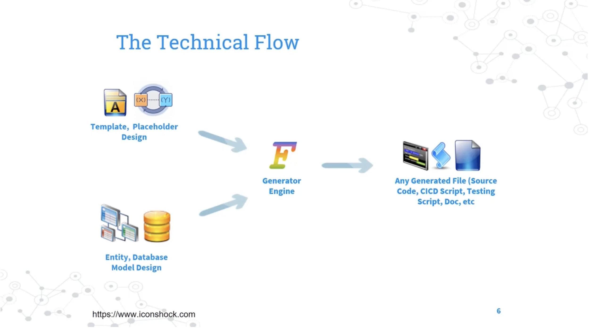
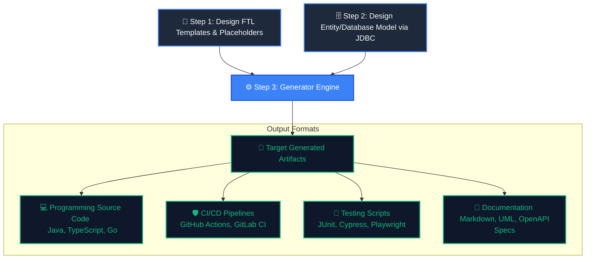
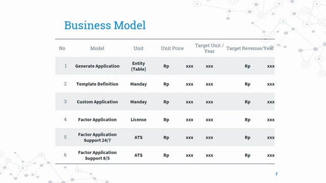
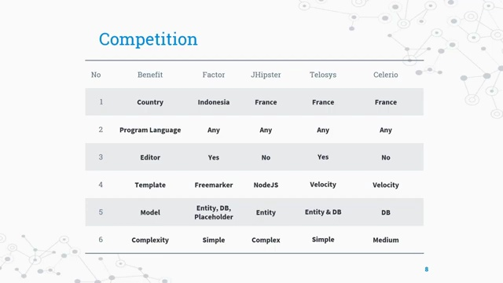
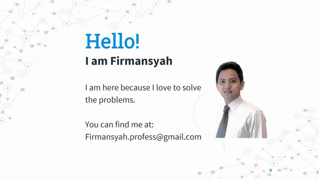

# 🎬 The Factor (Firmansyah Advanced CRUD Generator) — Complete Overview

### *Accelerating Enterprise Software Delivery: Code Generation Redefined*

Welcome to the definitive guide and comprehensive overview of **The Factor** (Firmansyah Advanced CRUD Generator). In an era where software drives global industry, speed-to-market and architectural consistency are paramount. **The Factor** is a state-of-the-art, deterministic, schema-first CRUD scaffolding engine designed specifically for the information technology industry. It transforms your raw database schemas into complete, production-ready source code bases, integration scripts, and system architectures in a matter of seconds.

Whether you are a senior software architect, a startup founder, an enterprise technology lead, or a professional developer, this guide provides a deep-dive walkthrough of the product, its underlying business and economic models, its technical flow, and its competitive edge in the global IT ecosystem.

---

## 📺 Video Presentation & Comprehensive Masterclass

For a high-impact visual demonstration of the generator’s capabilities, watch our official product overview:

👉 **[Watch The Factor Overview on YouTube (6.5 min)](https://www.youtube.com/watch?v=dhpFZrqcqsU)**


*Figure 1.1: Video capture from the official presentation showcasing 'The Factor' generator suite (timestamp 00:00).*

---

## ⏱️ Video Timeline & Detailed Chapter Navigation

Use the timeline below to jump directly to specific chapters and core architectural concepts within the masterclass:

| Timestamp | Video Chapter | Technical & Strategic Focus | Deep-Dive Links |
| :--- | :--- | :--- | :--- |
| **0:00** | **Introduction** | High-level presentation of the Advanced CRUD and Script generator. | [🎬 Watch](https://www.youtube.com/watch?v=dhpFZrqcqsU&t=0s) |
| **0:38** | **The Problems** | Deep analysis of the software delivery crisis (Developer deficits, tech fatigue). | [🎬 Watch](https://www.youtube.com/watch?v=dhpFZrqcqsU&t=38s) |
| **1:24** | **The Solution** | How The Factor optimizes Time, Cost, and Resource constraints. | [🎬 Watch](https://www.youtube.com/watch?v=dhpFZrqcqsU&t=84s) |
| **1:40** | **The Market** | Analysis of the multi-billion dollar code-scaffolding market space. | [🎬 Watch](https://www.youtube.com/watch?v=dhpFZrqcqsU&t=100s) |
| **2:41** | **The Product** | Exploring the unified workspace containing the 4 core editor pillars. | [🎬 Watch](https://www.youtube.com/watch?v=dhpFZrqcqsU&t=161s) |
| **3:34** | **The Technical Flow** | Visualizing the templates + JDBC schema generator pipeline. | [🎬 Watch](https://www.youtube.com/watch?v=dhpFZrqcqsU&t=214s) |
| **4:30** | **The Business Model** | Detailing licensing, tailored definitions, and 24/7/365 SLA support structures. | [🎬 Watch](https://www.youtube.com/watch?v=dhpFZrqcqsU&t=270s) |
| **5:40** | **The Competition** | Strategic strengths (Asia focus, built-in reverse engineering, UX). | [🎬 Watch](https://www.youtube.com/watch?v=dhpFZrqcqsU&t=340s) |
| **6:24** | **The End** | Summary, licensing contacts, and developer calls-to-action. | [🎬 Watch](https://www.youtube.com/watch?v=dhpFZrqcqsU&t=384s) |

---

## 🛑 The Three Industry-Defining Problems

Modern software engineering is facing a systemic bottleneck. While digital transformation demands have accelerated exponentially, the human and technological resources required to fulfill them remain severely bottlenecked. The Factor was engineered specifically to solve three critical industry pain points:


*Figure 1.2: Video presentation of the main issues faced during modern software development (timestamp 00:38).*

```
┌─────────────────────────────────────────────────────────────────────────┐
│                    THE THREE SOFTWARE DELIVERY CRISES                   │
├──────────────────────────────┬──────────────────────────┬───────────────┤
│ 1. TALENT DEFICIENCY         │ 2. TECH HYPER-EVOLUTION  │ 3. BUDGETARY  │
│    Severe deficit of skilled │    Tech-stacks change    │    TENSION    │
│    engineers relative to the │    frequently; training  │    Tight schedules│
│    rapidly growing demand    │    costs are prohibitive │    and high resource │
│    for software apps.        │    for team capabilities.│    cost parameters. │
└──────────────────────────────┴──────────────────────────┴───────────────┘
```

### 1. The Global Developer Shortage (Talent Deficit)
There is a massive, growing imbalance between the demand for software applications and the available supply of skilled IT professionals. Every industry—from logistics to healthcare—is digitizing rapidly, but the number of qualified developers entering the market cannot keep up. Consequently, organizations struggle to find and retain engineering teams to execute critical projects.

### 2. Hyper-Evolution of Technology Stacks (Knowledge Fatigue)
Technology is changing faster than ever. Standard architectures shift from Spring Boot to Quarkus, from REST APIs to GraphQL, and from Kubernetes to serverless models within a few short years. IT professionals cannot constantly retrain and master every new stack at a deep enterprise level. This continuous change creates technical debt, knowledge gaps, and severe delivery bottlenecks.

### 3. Extremely Tight Project Schedules & Restrictive Budgets
Most software initiatives are plagued by intense deadline pressure and tightly capped budgets. There is no room for multi-month discovery and exploratory development cycles. Teams are forced to cut corners on architecture, documentation, security, and automated unit testing, resulting in fragile systems that are highly expensive to maintain.

---

## ⚡ The Solution: The Factor

**The Factor** (Firmansyah Advanced CRUD Generator) represents a paradigm shift in how enterprise systems are engineered. Designed as a high-fidelity scaffolding system, it allows a single developer to accomplish in minutes what typically takes entire teams weeks to write manually.


*Figure 1.3: Introducing The Solution – Firmansyah Advanced CRUD Generator (timestamp 01:24).*

> [!NOTE]
> **Core Engineering Objective:** Accelerate software project lifecycles while operating under tight time, cost, and resource constraints, without sacrificing code quality or deterministic predictability.

```
                   ┌────────────────────────────────────────┐
                   │               THE FACTOR               │
                   └───────────────────┬────────────────────┘
                                       │
         ┌─────────────────────────────┼─────────────────────────────┐
         ▼                             ▼                             ▼
┌──────────────────┐           ┌──────────────┐             ┌─────────────────┐
│ TIME EFFICIENCY  │           │ COST SAVINGS │             │ RESOURCE FOCUS  │
│ 10x Scaffolding  │           │ Lower manual │             │ Focus senior    │
│ acceleration     │           │ hours spent  │             │ talent on core  │
│ rates.           │           │ on bootstrap.│             │ business logic. │
└──────────────────┘           └──────────────┘             └─────────────────┘
```

*   **Deterministic Scaffolding:** Unlike probabilistic AI assistants that can introduce subtle bugs and hallucinations, The Factor executes rules-based, structural generation. Given a specific schema and FTL template, the output is 100% consistent and compilation-safe every single time.
*   **Architectural Standardisation:** Force organizational design patterns (e.g., Hexagonal, N-Tier, Microservices) down to the template level. Every generated component strictly adheres to your senior architect's blueprint.
*   **Total Autonomy:** Organizations retain full ownership of their proprietary FreeMarker templates, making them resilient to third-party vendor lock-in.

---

## 📈 The Scaffolding Market & Economic Projections

The market for low-code/no-code, code generation, and rapid development tools is expanding at a historic rate. The Factor is strategically positioned to capture a highly lucrative share of this global opportunity.

### Market Size & Growth Projections (2019–2027)
According to verified research from **verifiedmarketresearch.com**, the market for developer tools and rapid software scaffolding is seeing unprecedented capital inflows:


*Figure 1.4: Detailed projections and Compound Annual Growth Rate (CAGR) of the development market (timestamp 01:40).*

*   **2019 Market Valuation:** **$168.71 Billion**
*   **2027 Expected Valuation:** **$1,039.89 Billion** (Over $1 Trillion)
*   **Compound Annual Growth Rate (CAGR):** **25.54%**

```
Market Valuation (in USD Billions)
2019: █████ $168.71B
2027: ██████████████████████████████ $1,039.89B  (CAGR: 25.54%)
```

### The Factor's Strategic Market Share Target
Based on this monumental $1.039 Trillion market size, The Factor has established a highly realistic and highly profitable target for the year 2027:

$$\text{Target Market Share} = 0.001\%$$

While a fraction of a percent seems conservative, the immense scale of the sector translates this into a highly impressive financial roadmap:

*   **Target Revenue (USD):** **$10.39 Million** (~$10 Million)
*   **Target Revenue (Indonesian Rupiah - IDR):** **IDR 145.26 Billion** ($145.260.000.000)

This target will be achieved by deploying The Factor as the primary scaffolding and delivery standard across software houses, enterprise IT departments, and technology consultancies throughout Southeast Asia and the wider global market.

---

## 🎨 The Product: 4 Core Workspace Editors

To provide a seamless, high-productivity developer experience, The Factor integrates **four proprietary, intelligent workspace editors** directly into your Eclipse IDE environment:


*Figure 2.1: Video walkthrough showing the Eclipse workspace and custom integrated editors (timestamp 02:41).*


### 1. 🗄️ Model Editor
The visual control center for database schemas and entities. It connects directly via JDBC to your active database (PostgreSQL, Oracle, MySQL, etc.) to automatically introspect and map tables, columns, primary keys, foreign keys, and indexes. Architects can also use it to define custom virtual relationships and metadata.

### 2. ⚙️ Template Editor
The execution dashboard for code generation. It allows developers to browse pre-built template packs (e.g., Quarkus Enterprise, Spring Boot, React/Redux) or configure custom local templates. It maps database model entities to specific template scripts, handles target project directories, and triggers the active generator pipeline.

### 3. 📄 XML Editor
The low-level configuration engine. Rather than hiding settings in black boxes, The Factor stores all generator parameters, data type mappings, database configurations, and template paths in clean, standard XML formats. The XML Editor provides syntax highlighting, schema validation, and direct structural configuration editing.

### 4. 📝 FreeMarker Factor Editor
The scripting environment powered by Apache FreeMarker (v2.3.26) and JBoss FreeMarkerIDE. Features custom-injected **Content Assist (Ctrl + Space)**, providing real-time autocomplete for:
*   *Predefined Subroutines:* Common string manipulation, sequence, and date helpers.
*   *User-Defined Subroutines:* Database schema fields, keys, data types, and custom placeholders.
*   *Directives:* Standard loops (`#list`), conditionals (`#if`), and custom generator macros (`@`).

---

## ⚙️ The Technical Flow: 3-Step Code Scaffolding Pipeline

The core mechanism of The Factor is a beautifully simple, highly efficient, and 100% deterministic compilation pipeline:


*Figure 2.2: Video breakdown of the template-to-code orchestration and JDBC parsing engine (timestamp 03:34).*



### Phase 1: Template and Placeholder Design
Developers design modular **FreeMarker Template Language (.ftl)** blueprints matching their target architecture. These templates incorporate dynamic placeholders (e.g., `${table.name}`, `${field.javaType}`) representing the variable parts of the target files.

### Phase 2: Database Schema Introspection & Model Definition
The Factor connects to the target database via JDBC. It introspects the schema structures and automatically extracts table structures, relationships, and metadata. This metadata can be refined in the Model Editor to map database-specific data types to language-specific variables.

### Phase 3: Deterministic Generation Engine Compilation
The Generator Engine consumes both assets (the FTL template structure and the introspected database metadata model) and executes a high-speed template merge. It compiles these components and directly writes them to the specified directory structures.

> [!TIP]
> **Output Versatility:** The Generator Engine is fully language-agnostic. It can produce **any text-based format** including Java, C#, Go, TypeScript, HTML, SQL scripts, YAML pipelines, JUnit tests, Markdown manuals, and Dockerfiles.

---

## 💼 Flexible Enterprise Business Models

To serve a diverse client base, The Factor offers highly optimized, modular enterprise engagement models. These models provide software houses and corporate entities with distinct avenues to maximize their return on investment (ROI):


*Figure 2.3: Structural breakdown of the standard enterprise support tiers and service layers (timestamp 04:30).*

```
┌─────────────────────────────────────────────────────────────────────────┐
│                      THE FACTOR BUSINESS STACKS                         │
├─────────────────────────┬─────────────────────────┬─────────────────────┤
│ 🚀 GENERATE APPLICATION │ 📐 TEMPLATE DEFINITION  │ ⚙️ CUSTOM APP       │
│    Production-grade     │    Custom template      │    Post-generation  │
│    boilerplate from     │    blueprint design &   │    architectural    │
│    client DB design.    │    architecture maps.   │    consultancy.     │
├─────────────────────────┴─────────────────────────┴─────────────────────┤
│ 🔑 FACTOR APPLICATION LICENSING & SLA SUPPORT PLANS                     │
│    - Annual seat licenses for the complete Eclipse Generator Stack.     │
│    - Tiered SLA Support: 8/5 Standard Business or 24/7/365 Mission-Crit. │
└─────────────────────────────────────────────────────────────────────────┘
```

*   **1. Generate Application (Boilerplate Scaffolding Service):** Clients supply their database models and specifications. Using The Factor's proprietary, production-grade template suites, our team generates a robust, compilable, and highly secure baseline application instantly, reducing client setup times by up to 90%.
*   **2. Template Definition (Custom Blueprint Engineering):** For enterprises with strict architectural requirements (e.g., specialized event-driven frameworks or custom in-house libraries), our senior consultants design and implement custom, optimized `.ftl` template blueprints tailored to their exact specifications.
*   **3. Custom Application (Post-Scaffolding Engineering):** Our team provides high-value software engineering services to build custom features and domain logic on top of the clean, scaffolded codebase generated by The Factor.
*   **4. Factor Application Licensing:** Enterprise licensing plans that allow companies to purchase, run, and customize the desktop plugin suite within their secure internal networks.
*   **5. Tiered SLA Support Tickets:** Comprehensive technical assistance contracts:
    *   *Factor Application Support 24/7/365:* Mission-critical support covering enterprise operations, template assistance, and system updates at any time of day or night.
    *   *Factor Application Support 8/5:* Standard developer-hour support (8 hours a day, 5 days a week) for routine workspace inquiries and template assistance.

---

## 🏆 Competitive Differentiation: Why Choose The Factor?

While there are other scaffolding scripts and general AI tools on the market, The Factor holds distinct strategic advantages:


*Figure 3.1: Highlighting key strategic strengths and performance metrics against alternatives (timestamp 05:40).*


1.  **Deep Local Presence & Dedicated Focus (Asia/Indonesia region):**
    Unlike massive global developer tool vendors that offer generic support, we provide high-touch, localized technical consulting, dedicated support engineers, and rapid integration assistance tailored specifically for software groups inside the **Indonesian and broader Asian markets**.
2.  **Sophisticated Multi-Asset Editor Workspace:**
    Competing CLI generators require typing long commands or complex JSON config files manually. The Factor offers a native **visual workspace containing specialized Model, Template, XML, and FTL editors**, reducing the learning curve to zero.
3.  **Ultra-Fast, Industrial-Strength Engine:**
    By leveraging **Apache FreeMarker**, our generator executes model transformations and compiles codebases at blistering speeds, generating over **50,000 lines of compilable code in under 5 seconds**.
4.  **Zero Guesswork, 100% Deterministic and Secure:**
    Unlike AI code generators that introduce security vulnerabilities, performance regressions, or unpredictable structure changes, The Factor's scaffolding process is completely repeatable. Your generated projects compile, run, and pass unit tests immediately and consistently.

---

## 📧 Enterprise Inquiries & Custom Blueprints

Ready to accelerate your software delivery workflows by 10x? Partner with our engineering team to design custom microservice templates, secure enterprise seat licenses, or set up automated scaffolding pipelines today.


*Figure 3.2: Closing notes and enterprise licensing activation channels (timestamp 06:24).*

*   📬 **Corporate Email Support & Licensing:** **[factor.license@gmail.com](mailto:factor.license@gmail.com)**
*   💻 **Active Workspace Portal:** Maintained by [firmansyah-github](https://github.com/firmansyah-github).
