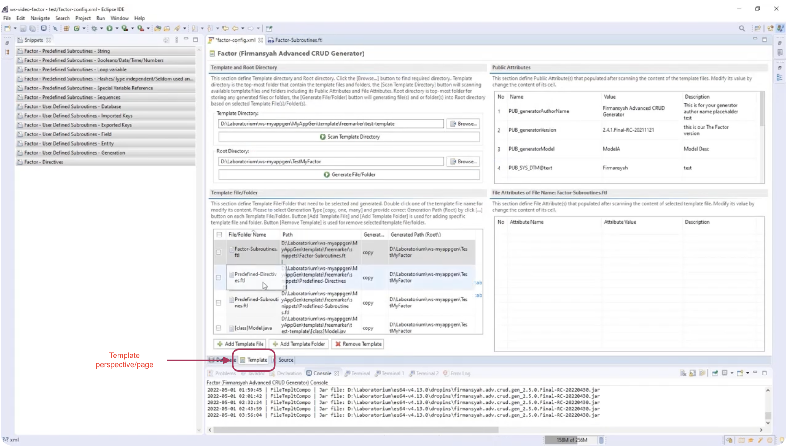
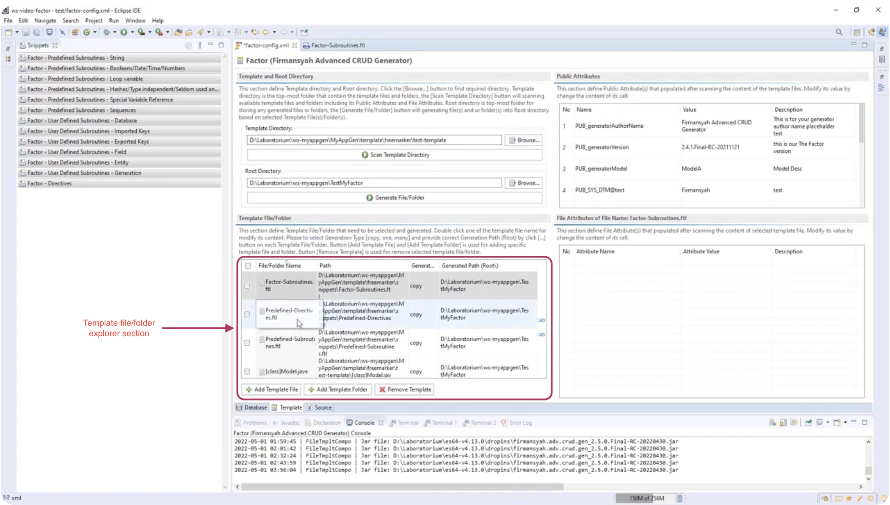
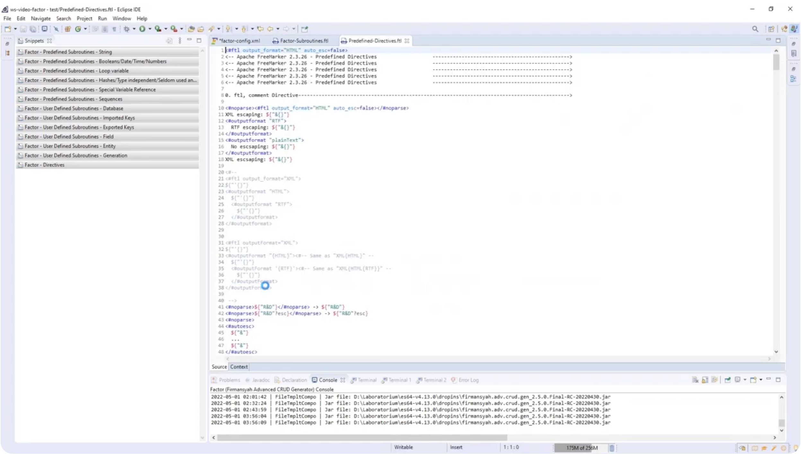
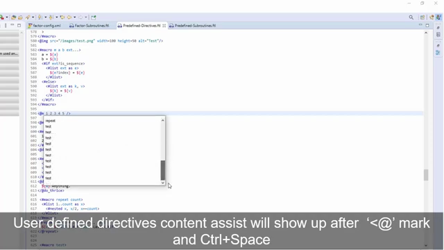
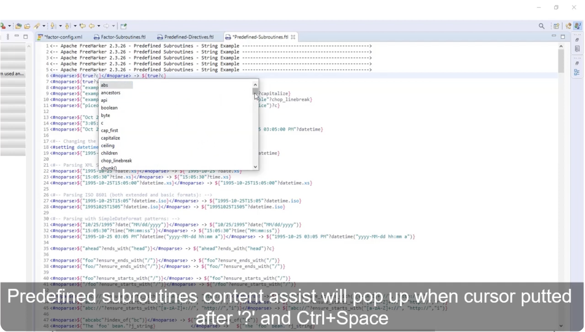
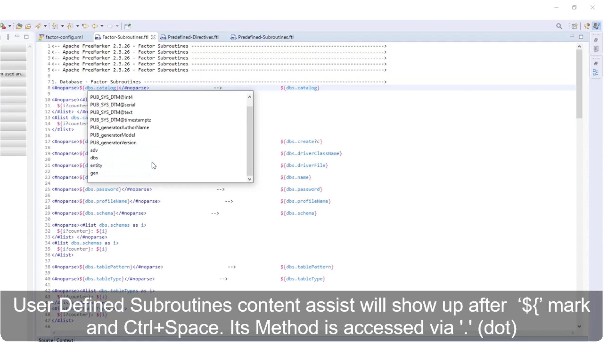
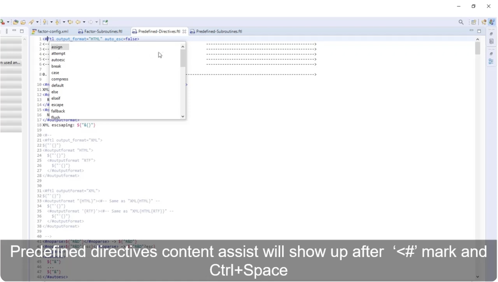
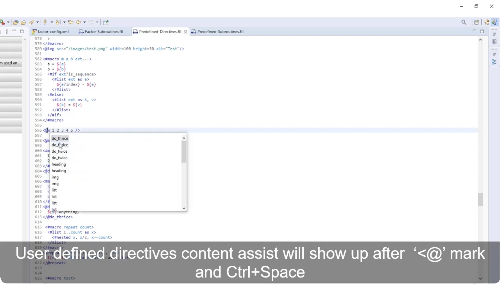

# 📝 Factor FreeMarker Template Editor

### *Supercharge Your Template Scaffolding with Intelligent Content Assist*

Welcome to the **FreeMarker Factor Template Editor** guide. Writing templates for the **Factor CRUD Scaffolding Generator** has never been easier. By combining robust open-source foundations with tailored editor plug-ins and dynamic code snippets, you unlock a fluid, high-productivity development environment inside your **Eclipse IDE**.

---

## 🚀 The Three Core Pillars of the Editor Stack

The FreeMarker Factor Editor is a professional-grade workspace powered by the synergy of three distinct software components:

1. **Apache FreeMarker Library (v2.3.26)**
   * **Role:** The core template engine from the Apache Software Foundation. It processes advanced logic, formatting, and data model mappings to generate clean source code.
2. **FreeMarkerIDE Eclipse Plugin (v1.5.300)**
   * **Role:** A dedicated IDE plugin designed by **JBoss (Red Hat)** (ID: `org.jboss.ide.eclipse.freemarker.feature.feature.group`). We have injected tailored enhancements into this plugin to fully recognize the custom Factor data models and properties during development.
3. **The Factor Snippets Suite**
   * **Role:** A collection of pre-configured code templates and macros that help developers rapidly understand, import, and test predefined subroutines, user-defined subroutines, and custom directives with zero cognitive load.

---

## 📺 Video Walkthrough & High-Quality Reference
For an in-depth video walkthrough of the editor layout, operations, and assist features, watch our comprehensive guide:
👉 **[Watch the FreeMarker Factor Editor Masterclass (YouTube)](https://www.youtube.com/watch?v=N4v91GyLumw)**

---

## 🛠️ Step-by-Step: How to Open the Editor

Getting started with the editor is direct and simple. Follow these steps:

1. Launch your **Eclipse IDE** containing the Factor workspace.
2. Open the main **Template** perspective/page.

   
   *Figure 1.1: The main Template page and perspective inside the active workspace.*

3. Locate the **Template file/folder** explorer section.

   
   *Figure 1.2: Identifying the Template files and folder explorer section.*

4. **Double-click** any of your target `.ftl` template files (e.g., `Entity.ftl`). The editor will open automatically with full syntax highlighting.

Below is an exact visual capture of the active template editor workspace:

*Figure 1.3: The FreeMarker Factor Editor workspace with the active FTL template editor.*

---

## 🎨 Autocomplete & Content Assist in Action

By opening the FTL template editor, you can use **Content Assist**. Typing the `<@` directive prefix followed by `Ctrl + Space` immediately launches the custom auto-complete panel, which displays all user-defined macros and subroutines dynamically inside your editor window.

Below is an exact visual frame capture demonstrating the auto-complete popup inside the active Eclipse template editor:

> [!IMPORTANT]
> **Pro-Tip for Developers:** To trigger this intelligent popup, ensure your cursor is placed directly after the `<@` characters inside your `.ftl` file, then press the standard Eclipse hotkey combination `Ctrl + Space` (or `Cmd + Space` on macOS).

---

## ⚡ The 3 Content Assist Modes

The FreeMarker Factor Editor provides three distinct, intelligent content assist modes to help you scaffold complex templates without manual typing errors.

### 1. Predefined Subroutines Content Assist
* **Description:** Access built-in FreeMarker functions (like string casing, list operations, boolean string filters).
* **Trigger:** Place your cursor immediately after the `?` mark inside an FTL interpolation and press `Ctrl + Space` (or `Cmd + Space` on macOS).

*Figure 2.1: Predefined subroutines list showing options like `?cap_first`, `?uncap_first` (timestamp 03:13).*

---

### 2. User-Defined Subroutines Content Assist
* **Description:** Access custom Factor database models and metadata classes (like tables, fields, imported keys, generation properties).
* **Trigger:**
  * Type **`${`** and press `Ctrl + Space`.
  * Alternatively, call content assist **inside any active directive tag**.

*Figure 2.2: Dynamic metadata properties list showing active variables like `${table.name}`, `${field.javaType}` (timestamp 04:11).*

---

### 3. Directives Content Assist
* **Description:** Insert core control structures, loops, and conditional statements.
* **Trigger:**
  * **Predefined Directives:** Type **`#`** and press `Ctrl + Space` to access standard FTL tags (e.g. `<#list>`, `<#if>`).

    
    *Figure 2.3: Autocomplete list for predefined FTL directives.*

  * **User-Defined Directives:** Type **`@`** and press `Ctrl + Space` to access custom scaffolding macros (e.g. `<@custom_macro>`).

    
    *Figure 2.4: Autocomplete list for user-defined Factor macros.*

---

## 🤝 Need Custom Scaffolding Blueprints?
The **Firmansyah Factor Enterprise Team** provides customized XML snippet suites and tailored macro drawers mapping directly to your proprietary architectures (Hexagonal, Microservices, Event-Driven).
📧 **[factor.license@gmail.com](mailto:factor.license@gmail.com)**

*Playground maintained by [firmansyah-github](https://github.com/firmansyah-github). Streamline your scaffolding today!*
