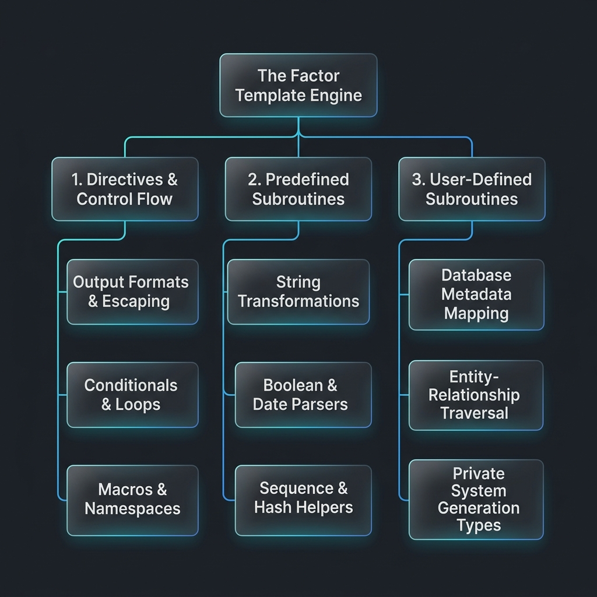

# 🧪 Factor FreeMarker Template Blueprint Example

Welcome to the **Ultimate FreeMarker Blueprint Lab** for **The Factor Advanced CRUD Scaffolding Generator**! 

This repository of live blueprint templates is designed to elevate your developer capabilities from standard boilerplate coding to high-velocity, enterprise-grade architecture automation. By pairing the robust capabilities of **Apache FreeMarker 2.3.26** with **The Factor Eclipse Plugin**, these blueprints serve as a masterclass in model-driven engineering.

Whether you are automating a microservices layer (like Quarkus or Spring Boot), generating complex data transfer objects (DTOs), or managing large-scale database metadata transformations, this guide provides the exact blueprints, interactive code samples, and video references to get you there.

---

## 🌟 The Three Pillars of The Factor Templating

Inside the Factor ecosystem, template blueprints are divided into three highly functional, modular categories, designed to reduce cognitive overhead and maximize code generation efficiency:




1. **Directives (`#` and `@`)**: Controls the logic, loops, output formats, and error recovery strategies within your templates.
2. **Predefined Subroutines (`?`)**: Standard FreeMarker utility functions for manipulating data types (strings, booleans, dates, collections) instantly.
3. **User-Defined Subroutines (`${...}`)**: The core enterprise models mapped directly from your database schemas (tables, columns, primary/foreign keys) and generator variables.

---

## ⚡ The Master Scaffolding Generation Types

To master dynamic code generation, it is crucial to understand the **Three Generation Modes** of The Factor. These modes are declared using private system attributes inside an FTL comment block:

| Generation Type | Attribute Syntax | Target Scope | Output Behavior | Evaluates Logic? |
| :--- | :--- | :--- | :--- | :--- |
| **`copy`** *(Default)* | `${PRV_SYS_GEN_TYPE\|copy\|...}` | Files & Folders | Copies file/folder structure exactly as-is to the destination path. | **No** (Direct raw copy) |
| **`one`** | `${PRV_SYS_GEN_TYPE\|one\|...}` | Files Only | Generates a single target file per template. Strips `.ftl` extension automatically. | **Yes** (Full evaluation) |
| **`many`** | `${PRV_SYS_GEN_TYPE\|many\|...}` | Files Only | Generates multiple files dynamically based on database entities. Supports placeholding patterns in paths and filenames. | **Yes** (Iterates over metadata) |

> [!IMPORTANT]
> **Understanding Path Resolution in `many` mode:**
> In the `many` generation mode, the final deployment path is calculated dynamically:
>
> ```text
> Output Path = [Deployment Root] + [PRV_SYS_GEN_PATH] + [PRV_SYS_JAVA_PACKAGE] + [PRV_SYS_GEN_FILENAME]
> ```
>
> Placeholders like `[class]`, `[table]`, `[instance]`, and `[base]` are substituted automatically during the rendering pipeline.


---

## 🗺️ Master Blueprint & Video Navigator

Use this highly synchronized master directory to jump straight to the code example or watch its dedicated video breakdown inside the Eclipse template editor.

| No | Blueprint Template File | Architectural Concept | Content Assist | Video Demonstration |
| :---: | :--- | :--- | :---: | :---: |
| **1** | [`factor.directives.*.ftl`](https://github.com/firmansyah-github/firmansyah-github.github.io/blob/master/factor.docs.templates.example/factor.directives.1.ftl.outputformat.comment.ftl) | FTL directives, macros, conditional namespaces, and comments. | [🎬 Watch](https://www.youtube.com/watch?v=N4v91GyLumw&t=312s) | [📺 Watch](https://www.youtube.com/watch?v=N4v91GyLumw&t=901s) |
| **2** | [`factor.predefined.subroutines.*.ftl`](https://github.com/firmansyah-github/firmansyah-github.github.io/blob/master/factor.docs.templates.example/factor.predefined.subroutines.1.string.ftl) | Predefined helper utilities for strings, lists, booleans, and dates. | [🎬 Watch](https://www.youtube.com/watch?v=N4v91GyLumw&t=193s) | [📺 Watch](https://www.youtube.com/watch?v=N4v91GyLumw&t=588s) |
| **3** | [`factor.user.defined.subroutines.*.ftl`](https://github.com/firmansyah-github/firmansyah-github.github.io/blob/master/factor.docs.templates.example/factor.user.defined.subroutines.1.database.ftl) | Database-to-class mappings, primary/foreign key graphs, and system paths. | [🎬 Watch](https://www.youtube.com/watch?v=N4v91GyLumw&t=251s) | [📺 Watch](https://www.youtube.com/watch?v=N4v91GyLumw&t=814s) |

---

## 🗂️ Detailed Blueprint File Registry

Below is a complete, descriptive breakdown of every single file in the Blueprint Lab, mapping their structural features to real-world software engineering needs:

### ⚙️ Group A: Dynamic Directives (`factor.directives.*`)
Learn to orchestrate logical control flow, content isolation, and code structure formatting.

* **1. [`factor.directives.1.ftl.outputformat.comment.ftl`](https://github.com/firmansyah-github/firmansyah-github.github.io/blob/master/factor.docs.templates.example/factor.directives.1.ftl.outputformat.comment.ftl)**
  * *Purpose:* Guides safe HTML/XML escaping parameters and multi-line comments.
  * *Key Features:* `<#outputformat>`, `<#autoesc>`, `<#no_esc>`, and structural comments (`<#-- -->`).
* **2. [`factor.directives.2.assign.attempt.recover.ftl`](https://github.com/firmansyah-github/firmansyah-github.github.io/blob/master/factor.docs.templates.example/factor.directives.2.assign.attempt.recover.ftl)**
  * *Purpose:* Variables declaration and custom error boundaries.
  * *Key Features:* `<#assign>` variable mapping and `<#attempt> ... <#recover>` fail-safe constructs.
* **3. [`factor.directives.3.compress.escape.flush.ftl`](https://github.com/firmansyah-github/firmansyah-github.github.io/blob/master/factor.docs.templates.example/factor.directives.3.compress.escape.flush.ftl)**
  * *Purpose:* Minification, whitespace removal, and text block escaping.
  * *Key Features:* `<#compress>` block wrapper, `<#escape>` mappings, and dynamic buffer flushes.
* **4. [`factor.directives.4.function.return.global.ftl`](https://github.com/firmansyah-github/firmansyah-github.github.io/blob/master/factor.docs.templates.example/factor.directives.4.function.return.global.ftl)**
  * *Purpose:* Designing complex, reusable data mapping logic routines.
  * *Key Features:* `<#function>` declarations, scope parameters, `<#global>` definitions, and `<#return>`.
* **5. [`factor.directives.5.if.elseif.else.import.include.ftl`](https://github.com/firmansyah-github/firmansyah-github.github.io/blob/master/factor.docs.templates.example/factor.directives.5.if.elseif.else.import.include.ftl)**
  * *Purpose:* Conditional logic control and file modularization.
  * *Key Features:* Conditional tags (`<#if>`, `<#elseif>`, `<#else>`) and modular builders (`<#import>`, `<#include>`).
* **6. [`factor.directives.6.list.else.items.sep.break.ftl`](https://github.com/firmansyah-github/firmansyah-github.github.io/blob/master/factor.docs.templates.example/factor.directives.6.list.else.items.sep.break.ftl)**
  * *Purpose:* Processing database collections, comma-separated lists, and code blocks.
  * *Key Features:* `<#list>`, `<#items>`, separator utilities (`<#sep>`), and loop escape boundaries (`<#break>`).
* **7. [`factor.directives.7.local.macro.nested.return.ftl`](https://github.com/firmansyah-github/firmansyah-github.github.io/blob/master/factor.docs.templates.example/factor.directives.7.local.macro.nested.return.ftl)**
  * *Purpose:* Defining custom templating components and HTML/Java wrappers.
  * *Key Features:* `<#macro>` definitions, `<#nested>` content slots, `<#local>` block scoping, and control returns.
* **8. [`factor.directives.8.stop.switch.case.default.break.trim.ftl`](https://github.com/firmansyah-github/firmansyah-github.github.io/blob/master/factor.docs.templates.example/factor.directives.8.stop.switch.case.default.break.trim.ftl)**
  * *Purpose:* Control branches and hard termination of execution during invalid states.
  * *Key Features:* `<#switch>`, `<#case>`, `<#default>`, and hard halts using `<#stop>`.
* **9. [`factor.directives.9.html_escape.setting.ftl`](https://github.com/firmansyah-github/firmansyah-github.github.io/blob/master/factor.docs.templates.example/factor.directives.9.html_escape.setting.ftl)**
  * *Purpose:* Configuring localized settings, formats, and escape parameters.
  * *Key Features:* `<#setting>` options, number formats, date patterns, and HTML escape helpers.

---

### 🛠️ Group B: Predefined Subroutines (`factor.predefined.subroutines.*`)
Accelerate standard data normalization, casing, formatting, and operations.

* **10. [`factor.predefined.subroutines.1.string.ftl`](https://github.com/firmansyah-github/firmansyah-github.github.io/blob/master/factor.docs.templates.example/factor.predefined.subroutines.1.string.ftl)**
  * *Purpose:* Essential string transformations for variable/class naming (e.g., camelCase, PascalCase).
  * *Key Features:* `?cap_first`, `?uncap_first`, `?upper_case`, `?lower_case`, `?replace`, `?split`, `?substring`.
* **11. [`factor.predefined.subroutines.2.booleans.date.time.numbers.ftl`](https://github.com/firmansyah-github/firmansyah-github.github.io/blob/master/factor.docs.templates.example/factor.predefined.subroutines.2.booleans.date.time.numbers.ftl)**
  * *Purpose:* Formatting configurations for primitives and timestamps.
  * *Key Features:* `?string("yes", "no")`, `?date`, `?time`, `?datetime`, and number formats (`?c`, `?string.currency`).
* **12. [`factor.predefined.subroutines.3.loop.hashes.specialVariable.ftl`](https://github.com/firmansyah-github/firmansyah-github.github.io/blob/master/factor.docs.templates.example/factor.predefined.subroutines.3.loop.hashes.specialVariable.ftl)**
  * *Purpose:* Accessing loop metrics, hash keys, and environment variables.
  * *Key Features:* `_has_next`, `_index`, `?keys`, `?values`, and special environmental variables (`.now`, `.version`).
* **13. [`factor.predefined.subroutines.4.sequences.ftl`](https://github.com/firmansyah-github/firmansyah-github.github.io/blob/master/factor.docs.templates.example/factor.predefined.subroutines.4.sequences.ftl)**
  * *Purpose:* Operating on lists and collections of tables or columns.
  * *Key Features:* `?size`, `?first`, `?last`, `?reverse`, `?sort`, `?sort_by`, `?chunk`, and `?join`.

---

### 📦 Group C: User-Defined & System Subroutines (`factor.user.defined.subroutines.*`)
Unlock the true power of automated models, architecture layers, packages, and paths.

* **14. [`factor.user.defined.subroutines.1.database.ftl`](https://github.com/firmansyah-github/firmansyah-github.github.io/blob/master/factor.docs.templates.example/factor.user.defined.subroutines.1.database.ftl)**
  * *Purpose:* Connecting to raw active SQL databases, schemas, catalogs, and connection parameters.
* **15. [`factor.user.defined.subroutines.2.generation.ftl`](https://github.com/firmansyah-github/firmansyah-github.github.io/blob/master/factor.docs.templates.example/factor.user.defined.subroutines.2.generation.ftl)**
  * *Purpose:* Orchestrating dynamic codebase layouts, target structures, base paths, and runtime metadata.
* **16. [`factor.user.defined.subroutines.3.draftTemplate.ftl`](https://github.com/firmansyah-github/firmansyah-github.github.io/blob/master/factor.docs.templates.example/factor.user.defined.subroutines.3.draftTemplate.ftl)**
  * *Purpose:* Crafting and testing playground variables with mock database structures.
* **17. [`factor.user.defined.subroutines.4.entity.field.pk.fk.ftl`](https://github.com/firmansyah-github/firmansyah-github.github.io/blob/master/factor.docs.templates.example/factor.user.defined.subroutines.4.entity.field.pk.fk.ftl)**
  * *Purpose:* **The Holy Grail of Scaffolding.** Illustrates the deep entities model—looping over tables, identifying properties, rendering data types, primary keys, and complex foreign key graphs (one-to-many, many-to-one).
* **18. [`factor.user.defined.subroutines.5.fileTemplate.attributes.ftl`](https://github.com/firmansyah-github/firmansyah-github.github.io/blob/master/factor.docs.templates.example/factor.user.defined.subroutines.5.fileTemplate.attributes.ftl)**
  * *Purpose:* Custom templates configurations, specific file encodings, and targeting profiles.
* **19. [`factor.user.defined.subroutines.6.private.system.copy.ftl`](https://github.com/firmansyah-github/firmansyah-github.github.io/blob/master/factor.docs.templates.example/factor.user.defined.subroutines.6.private.system.copy.ftl)**
  * *Purpose:* Hands-on blueprint for using the `copy` generation type.
  * *Key Video Reference:* [🎬 Watch Demo (timestamp 00:55)](https://www.youtube.com/watch?v=1303vgwI8x8&t=55s)
* **20. [`factor.user.defined.subroutines.7.private.system.one.ftl`](https://github.com/firmansyah-github/firmansyah-github.github.io/blob/master/factor.docs.templates.example/factor.user.defined.subroutines.7.private.system.one.ftl)**
  * *Purpose:* Hands-on blueprint for using the `one` generation type (single output mapping).
  * *Key Video Reference:* [🎬 Watch Demo (timestamp 06:34)](https://www.youtube.com/watch?v=1303vgwI8x8&t=394s)
* **21. [`factor.user.defined.subroutines.8.private.system.many.ftl`](https://github.com/firmansyah-github/firmansyah-github.github.io/blob/master/factor.docs.templates.example/factor.user.defined.subroutines.8.private.system.many.ftl)**
  * *Purpose:* The ultimate dynamic scaffolding engine file layout, demonstrating the `many` generation type with package-to-folder mapping.
  * *Key Video Reference:* [🎬 Watch Demo (timestamp 10:27)](https://www.youtube.com/watch?v=1303vgwI8x8&t=627s)
* **22. [`factor.user.defined.subroutines.9.public.system.datatype.mapping.ftl`](https://github.com/firmansyah-github/firmansyah-github.github.io/blob/master/factor.docs.templates.example/factor.user.defined.subroutines.9.public.system.datatype.mapping.ftl)**
  * *Purpose:* Custom maps translating SQL Database Data Types to Java/Kotlin/TypeScript Primitives dynamically.
* **23. [`factor.user.defined.subroutines.10.public.attributes.ftl`](https://github.com/firmansyah-github/firmansyah-github.github.io/blob/master/factor.docs.templates.example/factor.user.defined.subroutines.10.public.attributes.ftl)**
  * *Purpose:* Setting global, public project properties (like author name, copyright years, base namespaces).
* **24. [`factor.user.defined.subroutines.11.private.file.attributes.ftl`](https://github.com/firmansyah-github/firmansyah-github.github.io/blob/master/factor.docs.templates.example/factor.user.defined.subroutines.11.private.file.attributes.ftl)**
  * *Purpose:* Specifying attributes unique to a single template (e.g., target file suffix, specialized headers).

---

### 📦 Group D: Configurations & Shared Components

* **25. [`factor-config-example.xml`](https://github.com/firmansyah-github/firmansyah-github.github.io/blob/master/factor.docs.templates.example/factor-config-example.xml)**
  * *Purpose:* Complete, pre-configured Factor settings file. Load this into your workspace to immediately bind active databases with output generation paths.
* **26. [`lib/myinclude.ftl`](https://github.com/firmansyah-github/firmansyah-github.github.io/blob/master/factor.docs.templates.example/lib/myinclude.ftl) & [`lib/mylib.ftl`](https://github.com/firmansyah-github/firmansyah-github.github.io/blob/master/factor.docs.templates.example/lib/mylib.ftl)**
  * *Purpose:* Reusable library macro definitions and static code snippets designed to be imported at the top of templates.

---

## 🛠️ Step-by-Step: How to Explore & Test in Eclipse IDE

Get hands-on in your active workspace and experience real-time Content Assist:

### Step 1: Open the FTL Template Editor
1. In your **Eclipse IDE**, locate the **Templates explorer** in your workspace.
2. Double-click any of the blueprint files listed above (e.g., [`factor.predefined.subroutines.1.string.ftl`](https://github.com/firmansyah-github/firmansyah-github.github.io/blob/master/factor.docs.templates.example/factor.predefined.subroutines.1.string.ftl)).

### Step 2: Trigger the Content Assist
To explore predefined subroutines, variables, or system attributes:
* **For String Helpers:** Place your cursor right after any `?` symbol and hit **`Ctrl + Space`** (or **`Cmd + Space`** on macOS).
* **For Custom Database Elements:** Type **`${`** inside a template block and hit **`Ctrl + Space`** to watch the metadata assist list pop up.

```freemarker
<#-- Real-world Snippet from factor.user.defined.subroutines.4.ftl -->
<#list tables as table>
  public class ${table.className} {
    <#list table.fields as field>
      private ${field.javaType} ${field.fieldName};
    </#list>
  }
</#list>
```

---

## 💎 Need Enterprise Architecture Templates?

Are you designing a highly custom enterprise backend layer? The **Firmansyah Factor Enterprise Team** provides customized code-generation packages. Whether you require Clean Architecture, Domain-Driven Design (DDD), Hexagonal Layouts, or custom React/Angular frontends, we can design the blueprints for you.

📧 **Get in Touch:** **[factor.license@gmail.com](mailto:factor.license@gmail.com)**

---
*Playground maintained with 💻 and ☕ by [firmansyah-github](https://github.com/firmansyah-github). Happy Scaffolding!*
