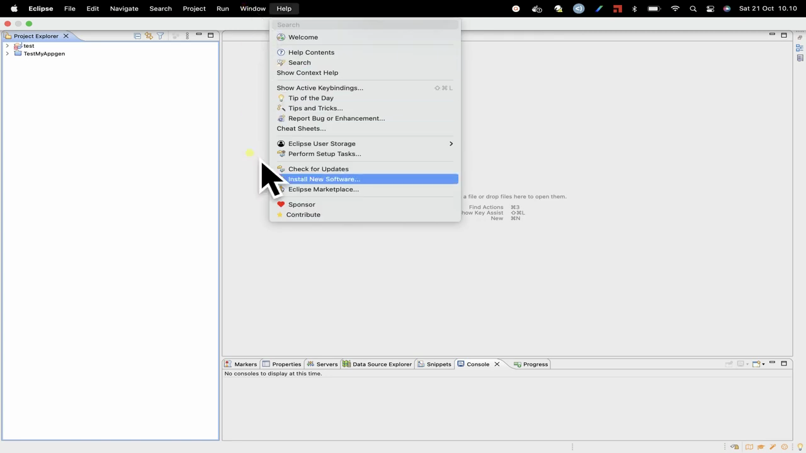
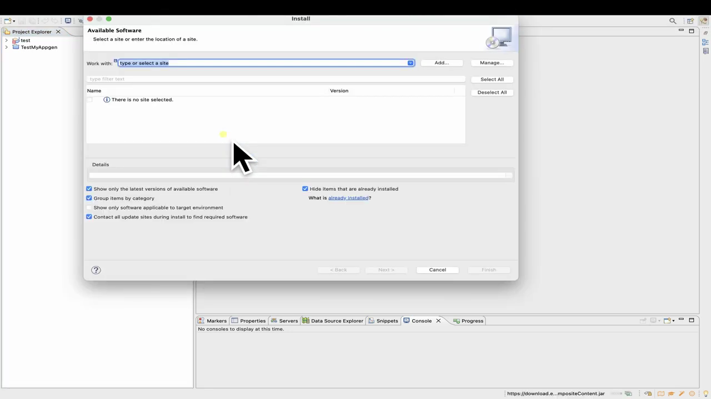
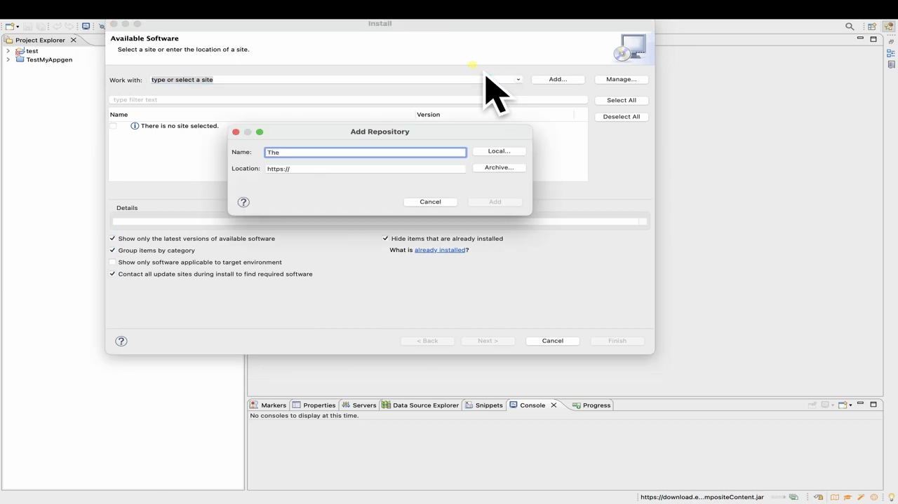
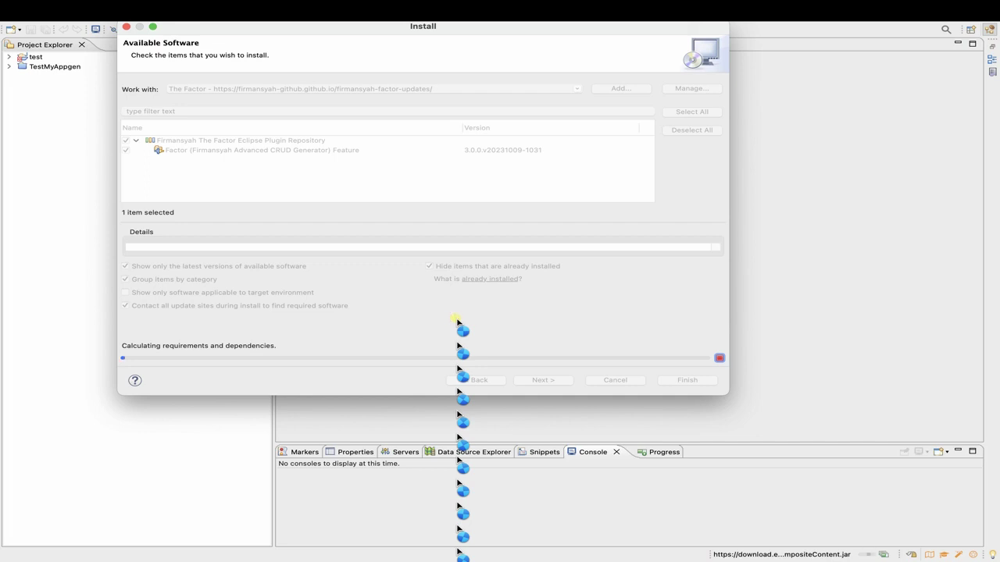
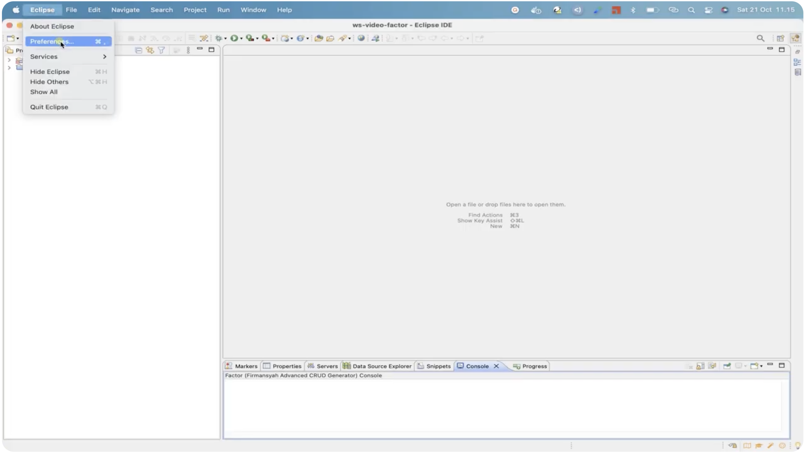
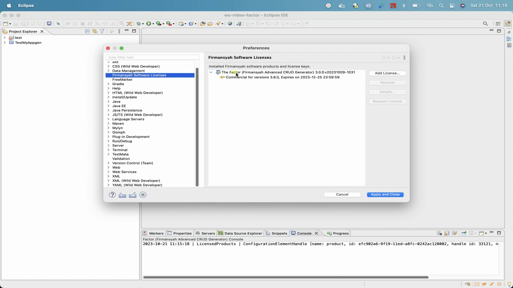
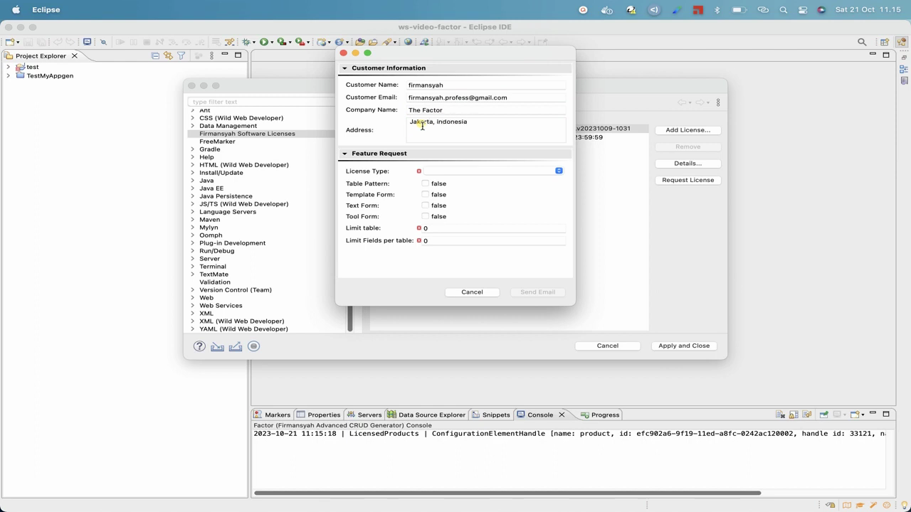
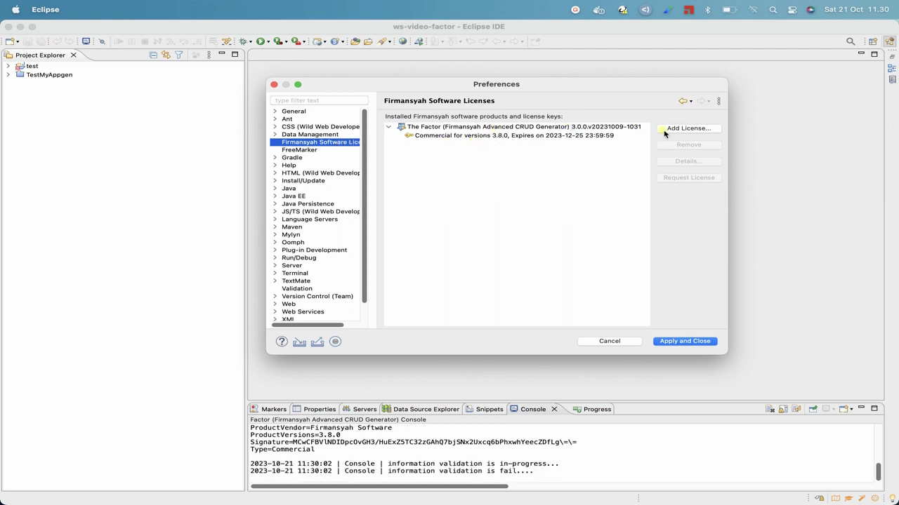
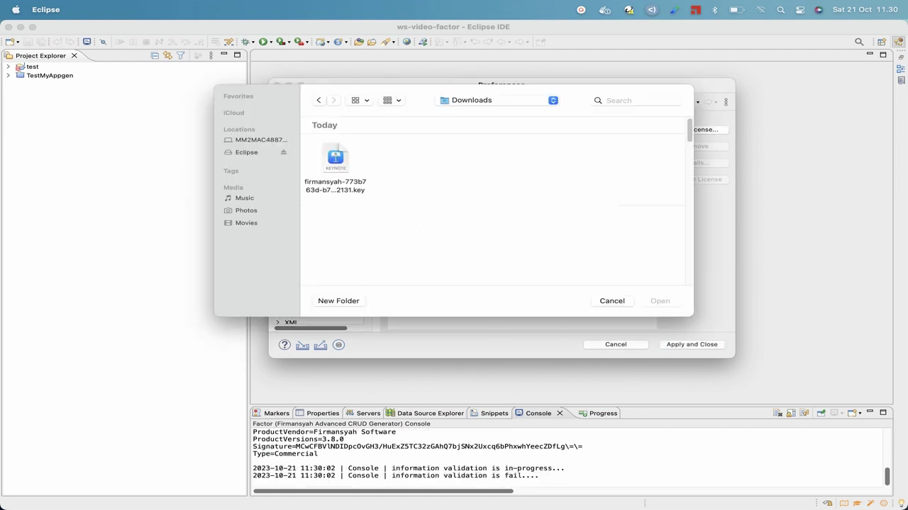
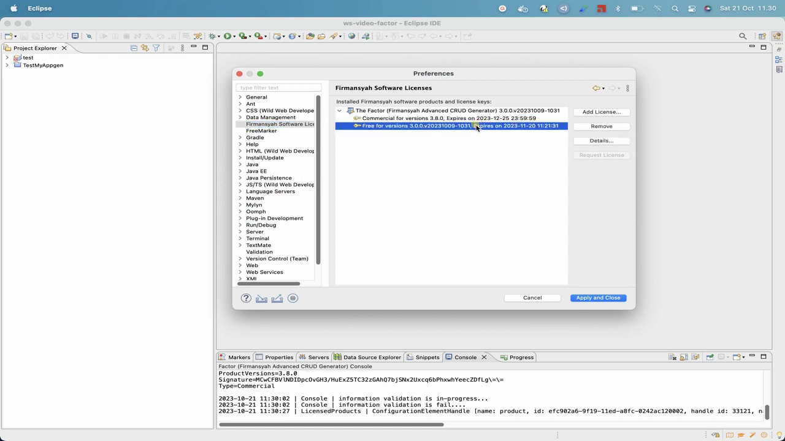

# 🚀 Firmansyah Advanced CRUD Generator (The Factor) Starter-kit Playground

Welcome to the **Firmansyah Factor Starter-kit Playground**! As an enterprise-grade toolkit designed for high-performance development, this playground serves as your primary environment for mastering **The Factor Eclipse Plugin** and accelerated template-based engineering.

Whether you are looking to automate boilerplate CRUD code, streamline database-to-application scaffolding, or leverage advanced Apache FreeMarker 2.3.26 templates, this repository provides the exact resources, patterns, and samples to help you scale.

---

## 🗺️ Workspace Core Components

This playground is structured around three foundational pillars, designed to dramatically reduce cognitive overhead and accelerate your development workflow:

### 1. 🧠 Factor FreeMarker Mindmap (Xmind)
To facilitate a rapid and deep understanding of Apache FreeMarker 2.3.26 (the powerful engine behind our code generators), we have provided a detailed, interactive mind map. This visual guide maps syntax, directives, and best practices directly into your brain.
👉 **[Explore the Mindmap & Xmind Guide](../factor.docs.freemarker.xmind/README.md)**

### 2. 🗃️ Factor Eclipse Snippet
Speed up your daily development with pre-configured, modular code snippets for Eclipse IDE. These XML snippet definitions integrate seamlessly into your workspace, allowing you to insert complex template blocks, loop constructs, and boilerplate declarations with a few simple keystrokes.
👉 **[Learn to Import and Use Snippets](../factor.docs.eclipse.snippets/README.md)**

### 3. 📝 Factor FreeMarker Template Editor
Supercharge your template authoring with the Factor Eclipse Template Editor. Combining Apache FreeMarker 2.3.26 and JBoss FreeMarkerIDE, this editor unlocks three powerful content assist modes (Predefined Subroutines, User-Defined Subroutines, and Directives Content Assist) complete with in-context autocomplete and workspace frame guides.
👉 **[Learn to Use the Template Editor](../factor.docs.templates.editor/README.md)**

### 4. 📄 Factor FreeMarker Template Blueprint Example
Hands-on, field-tested template blueprints that you can immediately modify, render, and deploy. These templates demonstrate how to unleash the full power of **"Content Assist of The Factor FreeMarker"** for automated code generation. Note that Content Assist is fully optimized when templates are edited inside the Factor Eclipse Plugin editor.
👉 **[Browse Template Blueprint Examples](../factor.docs.templates.example/README.md)**

---

## 📋 System Prerequisites

Before unlocking the full code-generation capabilities of The Factor, ensure your system meets the following standard enterprise requirements:

> [!NOTE]
> * **Integrated Development Environment (IDE):** Eclipse IDE (any modern version suitable for Java/Enterprise development).
> * **Active Compiler/Plugin:** The Factor Eclipse Plugin installed via our secure updates distribution site.
> * **Licensing:** A valid trial (Free) or production (Commercial) license key.
> * **Workspace Competency:** Basic familiarity with Eclipse workspace preferences and template structure.

---

## 🛠️ Step-by-Step Installation & Activation Guide

Follow this visual walkthrough to install, request, and activate your Factor Eclipse Plugin.

📺 **[Watch The Factor Installation Walkthrough Video (4.5 min)](https://www.youtube.com/watch?v=jqE1rQqsZ40)**

---

### Step 1: Download & Install Eclipse IDE

To get the industry-standard Eclipse IDE:
1. **Visit the Eclipse Portal:** Go to [Eclipse Official Website](https://www.eclipse.org/).
2. **Choose Your Flavor:** We recommend **Eclipse IDE for Enterprise Java and Web Developers** for optimal integration.
3. **Execute the Installer:** Run the Eclipse installer and follow the user-friendly prompts.
4. **Choose Your Workspace:** Set a dedicated folder on your disk where your projects will be housed.

### Step 2: Install the Required Eclipse Plugins

Our toolkit utilizes a modular two-tier architecture designed for optimal stability and performance:
1. **Firmansyah Framework Eclipse Plugin:** The core framework engine providing shared runtime libraries, OSGi bundle dependencies, and base licensing infrastructure. **This must be installed first.**
2. **The Factor Eclipse Plugin:** The advanced code generator engine that integrates table/field models with the FreeMarker rendering pipeline.

Follow these two installation phases sequentially to prepare your environment:

---

#### 📦 Phase A: Install the Firmansyah Framework Eclipse Plugin (Prerequisite)

> [!NOTE]
> **Video Walkthrough Exclude Note:** This prerequisite framework installation step is **not shown** in the YouTube video walkthrough, which focuses directly on the main Factor plugin. However, it must be installed first for the workspace dependencies to resolve successfully.

1. Launch your **Eclipse IDE**.
2. From the main toolbar, navigate to **Help ➡️ Install New Software...**
   
   

3. In the **Available Software** dialog, click the **Add...** button located on the top right.
   
   

4. In the **Add Repository** dialog, input the following framework configuration:
   * **Name:** `Firmansyah Framework Plugin`
   * **Location:** `https://firmansyah-github.github.io/firmansyah-framework-updates/`
   
   

   > [!IMPORTANT]
   > Verify the URL is typed precisely: `https://firmansyah-github.github.io/firmansyah-framework-updates/`. An incorrect URL will cause dependency failures when trying to install the main generator.

5. Click **OK**. The wizard will parse the update site repository.
6. Check the box next to **Firmansyah Framework Features** and click **Next**.
7. Review the installation details, accept the terms of the license agreement, and click **Finish**.
8. **Restart Eclipse:** When prompted, restart your IDE to complete the base framework initialization.

---

#### ⚙️ Phase B: Install The Factor Eclipse Plugin

Now that the core framework libraries are installed, proceed to install the advanced code-generation engine:

1. After Eclipse restarts, navigate back to **Help ➡️ Install New Software...**
2. Click the **Add...** button on the top right to add the Factor repository.
3. In the **Add Repository** dialog, input the following configuration:
   * **Name:** `Factor Eclipse Plugin`
   * **Location:** `https://firmansyah-github.github.io/firmansyah-factor-updates/`
   
   

   > [!IMPORTANT]
   > Ensure the URL matches exactly: `https://firmansyah-github.github.io/firmansyah-factor-updates/`. This site hosts the generator assemblies and active template models.

4. Click **OK**. The wizard will locate and parse the repository features.
5. Check the box next to **The Factor (Firmansyah Advanced CRUD Generator)** and click **Next**.
   
   

6. Review the installation details, accept the license terms, and click **Finish**.
7. **Restart Eclipse:** Restart your IDE a second time to initialize both layers together in your active workspace.

---

### Step 3: Request a Valid License Key

Once installed, you must provision a valid license key (either a 30-day Free trial or a full-powered Commercial subscription) to activate the advanced generation engines.

1. Open **Eclipse IDE**.
2. Go to **Preferences...** (located under Eclipse Menu on macOS, or Window Menu on Windows/Linux).
   
   

3. On the left navigation tree, select the **Firmansyah Software Licenses** category.
   
   

4. On the right panel, select **The Factor (Firmansyah Advanced CRUD Generator) X.Y.Z.vYYYYMMDD-HHMM** and click the **Request License** button.
5. In the pop-up license request form, fill in your details (Name, Corporate Email, and Company Name).
6. **Choose License Type:** Select either **"Free"** (Trial) or **"Commercial"** based on your target scale.
   
   

7. Click the **Send** button.
8. **Check Your Inbox:** An automated registration workflow will send your license file from `factor.license@gmail.com`.
   * 🎁 **Free License:** Grants a **30-day trial period** allowing up to **3 database tables** and a maximum of **3 fields per table**. Perfect for testing!
   * 💼 **Commercial License:** Grants a **1-year unlimited license** enabling large-scale, multi-table enterprise application generation.

---

### Step 4: Activate & Apply Your License Key

After receiving your license key file from the Factor Support Team, activate it in your workspace with these steps:

1. Launch your **Eclipse IDE** and open **Preferences...**
   
   

2. Select **Firmansyah Software Licenses** on the left menu.
   
   

3. Click the **Add License...** button on the right.
   
   

4. Locate the license file you downloaded from your email and click **Open**.
   
   

5. The system will validate the cryptographic signature. Once approved, the details, expiration date, and capabilities will be displayed dynamically.
   
   

6. Click **Apply and Close** to persist your license settings.
7. You are now fully authorized to utilize the advanced code-generation features!

---

## 🎓 Mastering the Advanced Editor Features

To transform yourself from a developer into a rapid-prototyping wizard, we have created comprehensive video guides. These videos will guide you through advanced model and template engineering, as well as the powerful autocomplete capabilities of the FreeMarker Factor Editor.

### 🎥 Video 1: Advanced Model & Template Engineering (46 min)

This in-depth masterclass covers advanced model configurations, schema linking, template mappings, and XML scaffolding customizations.

📺 **[Watch The Factor Masterclass Video (46 min)](https://youtu.be/jFHrv93ieGQ)**

#### 🧭 Video Chapters & Navigation Map

Skip directly to the specific topic you need using these synchronized timeline links:

* ⏱️ **[0:00 — Intro & Agenda](https://www.youtube.com/watch?v=jFHrv93ieGQ&t=0s)** — High-level overview of advanced code-scaffolding topics.
* ⏱️ **[1:10 — The Factor Installation Walkthrough (Skip this section)](https://www.youtube.com/watch?v=jFHrv93ieGQ&t=70s)** — Visual overview of installation steps (detailed above).
* ⏱️ **[3:31 — Model Editor: Database Configuration](https://www.youtube.com/watch?v=jFHrv93ieGQ&t=211s)** — Connecting your workspace to active SQL schemas and metadata.
* ⏱️ **[11:12 — Model Editor: Table Configuration](https://www.youtube.com/watch?v=jFHrv93ieGQ&t=672s)** — Mapping tables, primary keys, and relationships.
* ⏱️ **[16:50 — Model Editor: Field Configuration](https://www.youtube.com/watch?v=jFHrv93ieGQ&t=1010s)** — Configuring data types, constraints, validation rules, and controls.
* ⏱️ **[20:09 — Template Editor: Directory Configuration](https://www.youtube.com/watch?v=jFHrv93ieGQ&t=1209s)** — Defining multi-module target paths and project folder targets.
* ⏱️ **[24:43 — Template Editor: Template Configuration](https://www.youtube.com/watch?v=jFHrv93ieGQ&t=1483s)** — Linking FreeMarker directives, macro libraries, and source files.
* ⏱️ **[30:04 — Template Editor: Placeholder Configurations](https://www.youtube.com/watch?v=jFHrv93ieGQ&t=1804s)** — Utilizing dynamic placeholder keys for runtime injection.
* ⏱️ **[46:33 — XML Snippets & Custom Editors](https://www.youtube.com/watch?v=jFHrv93ieGQ&t=2793s)** — Extending the generator using customizable XML schemas.

---

### 🎥 Video 2: FreeMarker Factor Editor & Content Assist (17 min)

This professional-grade masterclass provides an exhaustive look into the **FreeMarker Factor Editor**—specifically focusing on the editor's advanced productivity boosters. You will learn how to leverage powerful content assist features, autocomplete subroutines, insert custom snippets, and streamline template authoring with directives.

📺 **[Watch the FreeMarker Factor Editor Masterclass (17 min)](https://www.youtube.com/watch?v=N4v91GyLumw)**

#### 🧭 Video Chapters & Navigation Map

Skip directly to the specific topic you need using these synchronized timeline links:

* ⏱️ **[0:00 — Agenda of This Video Content](https://www.youtube.com/watch?v=N4v91GyLumw&t=0s)** — Preview of what is covered in this editor masterclass.
* ⏱️ **[0:52 — FreeMarker Overview](https://www.youtube.com/watch?v=N4v91GyLumw&t=52s)** — Contextual foundation on the Apache FreeMarker template engine.
* ⏱️ **[1:19 — FreeMarker Factor Editor Overview](https://www.youtube.com/watch?v=N4v91GyLumw&t=79s)** — Touring the layout and workspace files within the Eclipse template editor.
* ⏱️ **[3:13 — Predefined Subroutines Content Assist](https://www.youtube.com/watch?v=N4v91GyLumw&t=193s)** — Leveraging built-in filters (like casing) using hotkeys (`Ctrl + Space`).
* ⏱️ **[4:11 — User Defined Subroutines Content Assist](https://www.youtube.com/watch?v=N4v91GyLumw&t=251s)** — Accessing custom database properties and field models dynamically.
* ⏱️ **[5:12 — Directives Content Assist](https://www.youtube.com/watch?v=N4v91GyLumw&t=312s)** — Auto-completing standard `#` and custom `@` directives.
* ⏱️ **[6:12 — The Factor Snippets](https://www.youtube.com/watch?v=N4v91GyLumw&t=372s)** — Bootstrapping code templates and layouts with pre-configured snippets.
* ⏱️ **[9:48 — Factor: Predefined Subroutines](https://www.youtube.com/watch?v=N4v91GyLumw&t=588s)** — Deep dive into pre-packaged snippets helper tools for Predefined Subroutines.
* ⏱️ **[13:34 — Factor: User Defined Subroutines](https://www.youtube.com/watch?v=N4v91GyLumw&t=814s)** — Hands-on examples mapping database schema properties using User Defined Subroutines snippets.
* ⏱️ **[15:01 — Factor: Directives](https://www.youtube.com/watch?v=N4v91GyLumw&t=901s)** — Generating advanced loops and structures using Directives snippets.
* ⏱️ **[16:35 — The End](https://www.youtube.com/watch?v=N4v91GyLumw&t=995s)** — Summary and recommendations for further mastering template generation.

---

### 🎥 Video 3: Template Generation Types — Copy, One & Many (11 min)

This professional-grade masterclass focuses on the core **Generation Types (Copy, One, Many)** in the Factor Eclipse Plugin. You will learn the mechanical differences, configuration mappings, and see live demonstrations of static file copying (`Copy`), single-entity generation (`One`), and dynamic relation-driven scaffolding (`Many`).

📺 **[Watch the Template Generation Types Masterclass (11 min)](https://www.youtube.com/watch?v=1303vgwI8x8)**

#### 🧭 Video Chapters & Navigation Map

Skip directly to the specific topic you need using these synchronized timeline links:

* ⏱️ **[0:00 — Intro & Agenda](https://www.youtube.com/watch?v=1303vgwI8x8&t=0s)** — High-level preview of template generation types.
* ⏱️ **[0:55 — Copy Generation Type Demo](https://www.youtube.com/watch?v=1303vgwI8x8&t=55s)** — Live demonstration of static file copying and assets generation.
* ⏱️ **[6:34 — One Generation Type Demo](https://www.youtube.com/watch?v=1303vgwI8x8&t=394s)** — How to configure and scaffold exactly one source file per database table.
* ⏱️ **[10:27 — Many Generation Type Demo](https://www.youtube.com/watch?v=1303vgwI8x8&t=627s)** — Advanced multi-file scaffolding driven by complex database table relationships.

---

## 🗃️ Complete Blueprint Project Reference

To help you get started with real-world builds, refer to our complete enterprise blueprint template repository:

* ☕ **[Quarkus Backend Architecture Blueprint](https://github.com/firmansyah-github/firmansyah.template.quarkus.git)**  
  A fully designed template setup using Quarkus, Hibernate ORM, and PostgreSQL. Demonstrates how to map dynamic CRUD models straight into production-ready Java microservices.

---

> Built with 💻 and ☕ by the **Firmansyah Factor Enterprise Team**. For support, license inquiries, and custom template development, contact us via **[factor.license@gmail.com](mailto:factor.license@gmail.com)**.

