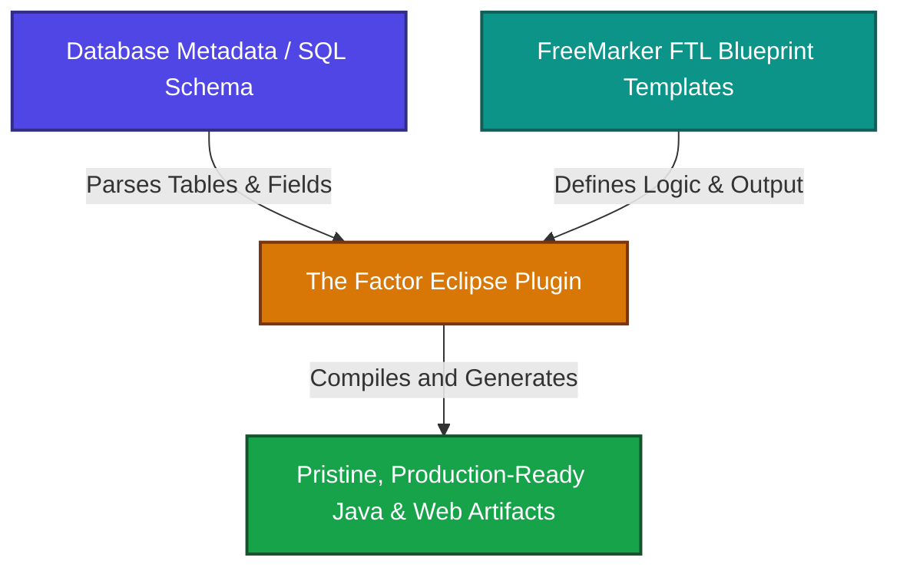

# 🚀 Apache FreeMarker 2.3.26 Master Learning Kit
### *Accelerating Dynamic Template Engineering for The Factor Eclipse Plugin*

Welcome to the **Apache FreeMarker 2.3.26 Master Learning Kit**. This comprehensive workspace resource is designed to help software engineers, enterprise architects, and rapid-prototyping specialists master the template rendering engine powering **The Factor (Firmansyah Advanced CRUD Generator) Eclipse Plugin**.

---

## 📖 The Power of Scaffolding: Why Apache FreeMarker?

In high-performance enterprise development, **boilerplate is the enemy of velocity**. The Factor Eclipse Plugin addresses this challenge by utilizing **Apache FreeMarker 2.3.26**—a highly optimized, zero-dependency, Java-based template engine. 



By separating database model concerns from the target source code, FreeMarker allows you to define flexible blueprints once, and then generate thousands of lines of highly clean, architectural-pattern-compliant code (e.g., Clean Architecture, Hexagonal, or N-Tier MVC) in milliseconds. 

> [!NOTE]
> FreeMarker is NOT limited to producing Java source files. The Factor leverages it to scaffold **XML mappings, HTML5/CSS3 frontends, Kubernetes YAML manifests, properties configurations, and OpenAPI specifications** dynamically.

---

## 🧠 The Interactive Visual Map (`Apache FreeMarker.xmind`)

To bypass the typical steep learning curve of advanced templating, we have provided an **all-inclusive interactive Mind Map** at `[Apache FreeMarker.xmind](./xmind/Apache%20FreeMarker.xmind)`. This visual workspace maps every core capability, directive, built-in filter, and sub-routine directly into your development workflow.

Here is a curated walkthrough of the primary dimensions represented in the mind map:

### 1. High-Level Architecture
Covers the three foundational domains of Apache FreeMarker: the **Programmer's Guide** (integrating FreeMarker into custom Java frameworks), the **XML Processing Guide** (transforming hierarchical schemas), and the **Template Author Guide** (the core environment for template customizers).

*Online Link:* [Apache FreeMarker 2.3.26 Architecture Diagram](https://github.com/firmansyah-github/firmansyah.factor.starterkit.playground/blob/master/factor.freemarker.xmind/images/Apache%20FreeMarker%202.3.26.png)

### 2. Predefined Directives
Your structural building blocks. It is highly recommended to focus on this section, as these directives control loop constructs, conditional evaluations, context definitions, macro creation, and module imports inside your code blueprints.

*Online Link:* [Predefined Directives Mind Map](https://github.com/firmansyah-github/firmansyah.factor.starterkit.playground/blob/master/factor.freemarker.xmind/images/Predefined%20Directives.png)

### 3. Predefined Subroutines (Built-In Filters)
These are utility subroutines that act directly on data types. They allow you to transform table and field names dynamically—such as converting standard database naming conventions (`USER_ORDER_DETAIL`) into camel-case Class names (`UserOrderDetail`), checking for null values, or formatting numeric IDs.

*Online Link:* [Predefined Subroutines Mind Map](https://github.com/firmansyah-github/firmansyah.factor.starterkit.playground/blob/master/factor.freemarker.xmind/images/Predefined%20Subroutines.png)

### 🕹️ How to Navigate the Mind Map in XMind
Once you load the file in XMind, use these interactive tips for maximum comprehension:
* **Expand & Collapse Branches:** Click the `+` or `-` nodes to reveal finer levels of detail under core directives or subroutines.
* **Interactive Code Notes:** Look for the **Note Icon** 📝 next to nodes. Clicking this will launch a popover containing actual, copy-pasteable FreeMarker template code samples, demonstrating how to use the target directive in real-world scenarios.
* **Pan & Zoom:** Hold `Right-Click` or your trackpad spacebar to pan across large, highly detailed branches of the template architecture.

---

## ⚙️ Universal Desktop Setup: Installing XMind

To interact with the visual map, install the standard XMind brainstorming utility on your workstation. Follow the tailored installation guide for your operating system below:

### Prerequisites
* A computer running **Windows 10/11**, **macOS** (Intel or Apple Silicon), or a modern **Linux** distribution.
* Administrative privileges (if required for application deployment).
* An active internet connection for downloading the binary installer.

---

### 💻 OS-Specific Installation Instructions

#### 🏁 On Microsoft Windows
1. **Download the Installer:** Visit the [Official XMind Download Portal](https://www.xmind.app/desktop/) and download the Windows executable (e.g., `XMind-setup-<version>-windows.exe`).
2. **Execute Installation:** Double-click the downloaded `.exe` file to initiate the installation wizard.
3. **Follow the Wizard:** Choose your target installation folder, check "Create a desktop shortcut" for quick access, and click **Next**.
4. **Complete Setup:** When the progress bar finishes, click **Finish**. XMind will launch automatically.

#### 🍎 On Apple macOS
1. **Download the Disk Image:** Download the macOS package (e.g., `XMind-<version>-mac.dmg`).
2. **Mount the Image:** Double-click the downloaded `.dmg` file in your Downloads directory to open the volume.
3. **Drag & Drop:** Drag the XMind icon and drop it directly into your **Applications** folder.
4. **First Launch:** Navigate to your Applications list or launch Spotlight (`Cmd + Space`), type "XMind", and open it. Click "Open" if prompted by macOS gatekeeper security.

#### 🐧 On Linux (Tarball Archive)
1. **Download the Linux Build:** Download the `.tar.gz` package provided for Linux distributions.
2. **Open Terminal:** Open a shell shell session and navigate to your download target folder:
   ```bash
   cd ~/Downloads
   ```
3. **Extract the Archive:** Extract the contents using the `tar` command (replace `<version>` with the downloaded version):
   ```bash
   tar -xzvf xmind-<version>-linux.tar.gz
   ```
4. **Position and Run:** Move into the extracted catalog and launch the main executable binary:
   ```bash
   cd xmind-<version>
   ./XMind
   ```

---

### 📂 Step-by-Step Onboarding: Opening the Mind Map
1. **Launch XMind** from your workstation's application launcher.
2. If prompted, you can **Sign In** or choose **Skip** to bypass account registration and use XMind offline immediately.
3. From the main menu, navigate to **File ➡️ Open...** (or press `Ctrl + O` / `Cmd + O`).
4. Browse your file system, navigate to this starter-kit workspace, and select the mind map located at:
   `./factor.freemarker.xmind/xmind/Apache FreeMarker.xmind`
5. The visual workspace will open instantly. You are now ready to explore!

---

## 🎓 FreeMarker Syntax Bootcamp for The Factor

To help you bridge the gap between mind-mapping theory and real-world template engineering, here is a highly practical, senior-teacher guided overview of how FreeMarker directives and built-ins are utilized in **The Factor** to scaffold custom code models.

### Core Variable Scope in The Factor
When The Factor runs a template, it automatically injects a rich domain model representing your database schemas. Common variables in this context include:
* `table`: The current database table being parsed (contains properties like `table.name`, `table.capitalizedName`, `table.fields`).
* `field`: The current column/field model (contains properties like `field.name`, `field.javaType`, `field.isPrimaryKey`, `field.isNullable`).

---

### 1. Dynamic Looping: Generating Java Fields
To generate clean private attributes for a standard Java entity class, we loop through all fields of a database table using the `<#list>` directive:

**Template Source Code (`FTL`):**
```html
public class ${table.capitalizedName}Entity {

<#list table.fields as field>
    /**
     * ${field.comment!"No description provided."}
     */
    private ${field.javaType} ${field.name};
</#list>

}
```

**Generated Production Code (`Java`):**
```java
public class UserOrderDetailEntity {

    /**
     * Primary auto-incrementing identifier
     */
    private Long id;

    /**
     * The customer name associated with this transaction
     */
    private String customerName;

}
```

---

### 2. Intelligent String Formatting (Built-ins)
Converting lowercase database notation to enterprise CamelCase is achieved using string subroutines:
* `?cap_first`: Capitalizes the first letter of a string (perfect for Class names).
* `?uncap_first`: Lowercases the first letter of a string (perfect for variable names).
* `?replace(target, replacement)`: Finds and replaces matches in strings.

**Template Source Code (`FTL`):**
```html
// Class instantiation
${table.capitalizedName} ${table.capitalizedName?uncap_first} = new ${table.capitalizedName}();

// Accessing a getter method
System.out.println("Processing: " + ${table.capitalizedName?uncap_first}.get${field.name?cap_first}());
```

**Generated Production Code (`Java`):**
```java
// Class instantiation
UserOrderDetail userOrderDetail = new UserOrderDetail();

// Accessing a getter method
System.out.println("Processing: " + userOrderDetail.getCustomerName());
```

---

### 3. Conditional Branching: Null Safety & Primary Keys
Use the `<#if>` and `<#else>` directives to implement conditional output—such as adding `@Id` annotations on primary keys or configuring validation decorators on nullable fields.

**Template Source Code (`FTL`):**
```html
<#list table.fields as field>
    <#if field.isPrimaryKey>
    @Id
    @GeneratedValue(strategy = GenerationType.IDENTITY)
    </#if>
    <#if !field.isNullable && !field.isPrimaryKey>
    @NotNull(message = "Field ${field.name} cannot be null")
    </#if>
    private ${field.javaType} ${field.name};

</#list>
```

**Generated Production Code (`Java`):**
```java
    @Id
    @GeneratedValue(strategy = GenerationType.IDENTITY)
    private Long id;

    @NotNull(message = "Field customerName cannot be null")
    private String customerName;
```

---

### 💡 Pro-Tips for Masterful Factor Templating
* **Utilize Content Assist:** Always write and edit your `.ftl` templates inside the specialized editor in the **Factor Eclipse Plugin**. It provides real-time Content Assist (code completion) showing all available table and field properties!
* **Default Values:** Use the `!` operator to provide robust fallbacks for potentially empty metadata, e.g., `${field.label!"Unknown Column"}`. This prevents compilation failures during generation.
* **Capitalization Rules:** When mapping schemas, remember to combine filters, e.g., `${table.name?lower_case?cap_first}` to turn `USER_PROFILE` into `User_profile`, or use the plugin's built-in `table.capitalizedName` for pure camel-cased `UserProfile`.

---

## 🤝 Community & Commercial Support
The **Firmansyah Factor Enterprise Team** is committed to your accelerated development. 
* 🎁 **Free License Support:** Register your IDE instance for a complimentary trial license to build blueprints on up to 3 tables.
* 💼 **Enterprise Consulting:** Contact us for custom macro libraries, complex database multi-tier templates (Hexagonal/Microservices), and team training sessions via:
  📧 **[factor.license@gmail.com](mailto:factor.license@gmail.com)**

*Playground maintained by [firmansyah-github](https://github.com/firmansyah-github). Unleash the speed of Factor today!*
